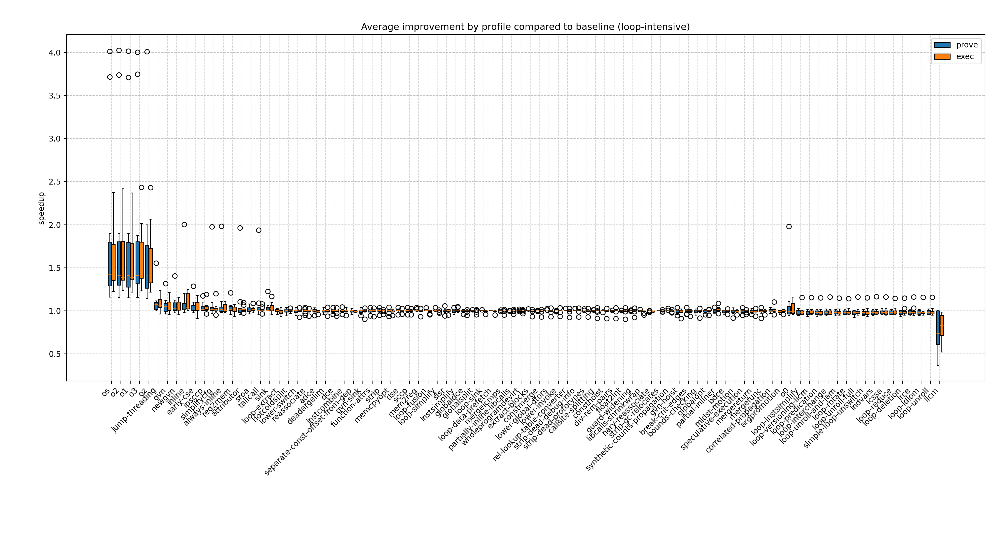
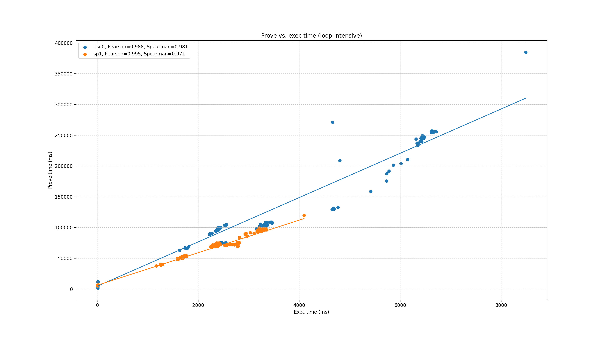

# loop-intensive report

## Programs

- [loop-sum](../programs/loop-sum.md)
- [fibonacci](../programs/fibonacci.md)
- [npb-bt](../programs/npb-bt.md)
- [npb-lu](../programs/npb-lu.md)
- [npb-sp](../programs/npb-sp.md)

## Speedup by profile
  

## % faster
  

### risc0 % faster
  

### sp1 % faster
  

## Prove vs. exec duration
  
