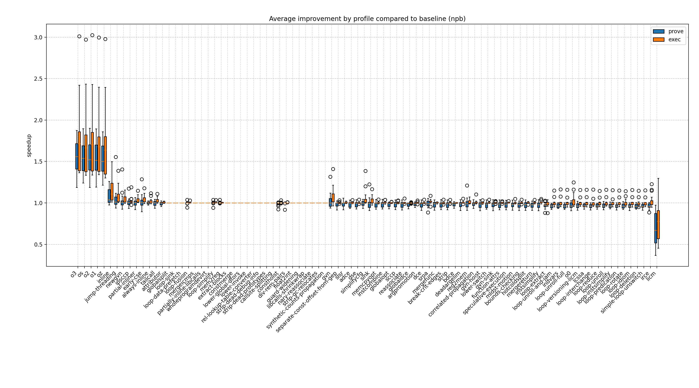
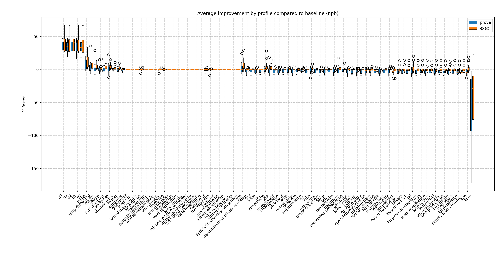
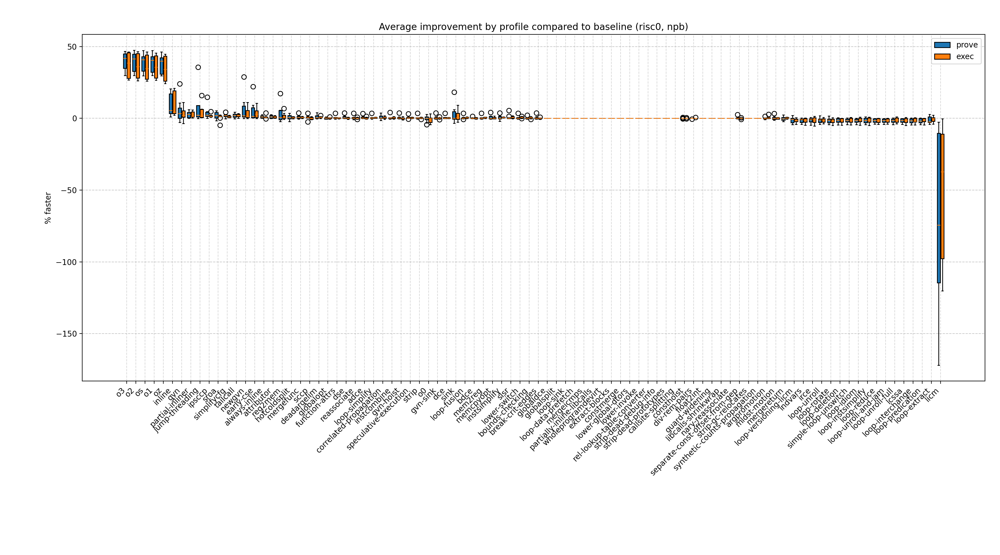
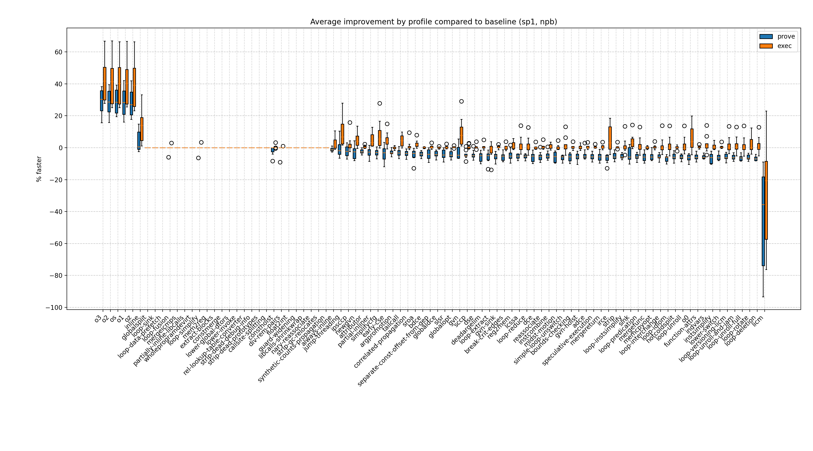

# npb report

## Programs

- [npb-bt](../programs/npb-bt.md)
- [npb-cg](../programs/npb-cg.md)
- [npb-ep](../programs/npb-ep.md)
- [npb-ft](../programs/npb-ft.md)
- [npb-is](../programs/npb-is.md)
- [npb-lu](../programs/npb-lu.md)
- [npb-mg](../programs/npb-mg.md)
- [npb-sp](../programs/npb-sp.md)

## Speedup by profile
  

## % faster
  

### risc0 % faster
  

### sp1 % faster
  

## Prove vs. exec duration
  
