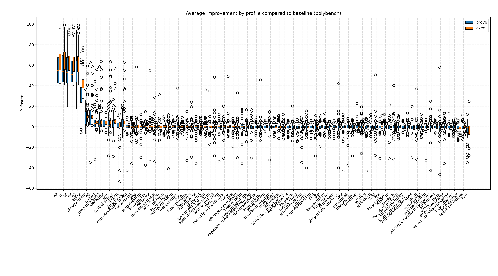
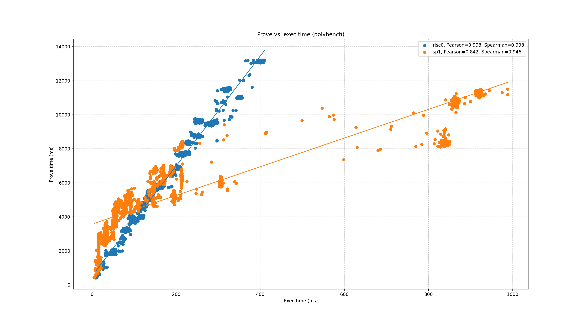

# polybench report

## Programs

- [polybench-2mm](../programs/polybench-2mm.md)
- [polybench-3mm](../programs/polybench-3mm.md)
- [polybench-adi](../programs/polybench-adi.md)
- [polybench-atax](../programs/polybench-atax.md)
- [polybench-bicg](../programs/polybench-bicg.md)
- [polybench-cholesky](../programs/polybench-cholesky.md)
- [polybench-correlation](../programs/polybench-correlation.md)
- [polybench-covariance](../programs/polybench-covariance.md)
- [polybench-deriche](../programs/polybench-deriche.md)
- [polybench-doitgen](../programs/polybench-doitgen.md)
- [polybench-durbin](../programs/polybench-durbin.md)
- [polybench-fdtd-2d](../programs/polybench-fdtd-2d.md)
- [polybench-floyd-warshall](../programs/polybench-floyd-warshall.md)
- [polybench-gemm](../programs/polybench-gemm.md)
- [polybench-gemver](../programs/polybench-gemver.md)
- [polybench-gesummv](../programs/polybench-gesummv.md)
- [polybench-gramschmidt](../programs/polybench-gramschmidt.md)
- [polybench-heat-3d](../programs/polybench-heat-3d.md)
- [polybench-jacobi-1d](../programs/polybench-jacobi-1d.md)
- [polybench-jacobi-2d](../programs/polybench-jacobi-2d.md)
- [polybench-lu](../programs/polybench-lu.md)
- [polybench-ludcmp](../programs/polybench-ludcmp.md)
- [polybench-mvt](../programs/polybench-mvt.md)
- [polybench-nussinov](../programs/polybench-nussinov.md)
- [polybench-seidel-2d](../programs/polybench-seidel-2d.md)
- [polybench-symm](../programs/polybench-symm.md)
- [polybench-syr2k](../programs/polybench-syr2k.md)
- [polybench-syrk](../programs/polybench-syrk.md)
- [polybench-trisolv](../programs/polybench-trisolv.md)
- [polybench-trmm](../programs/polybench-trmm.md)

## Speedup by profile
  

## % faster
  

### risc0 % faster
  

### sp1 % faster
  

## Prove vs. exec duration
  
