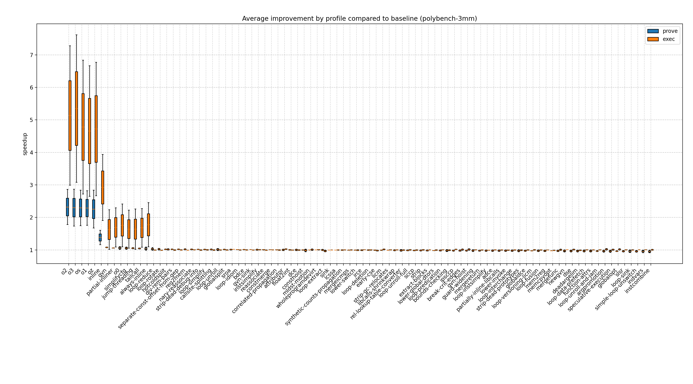
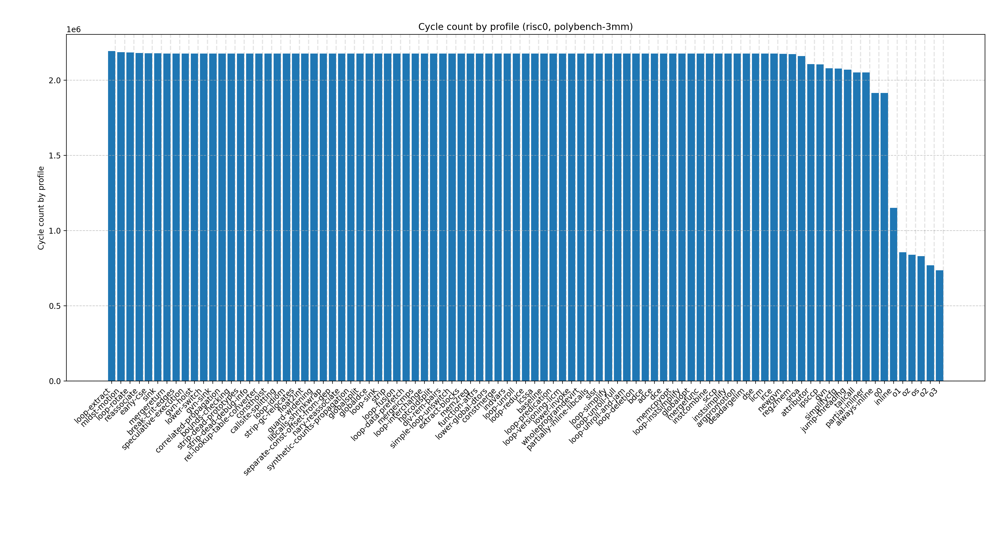
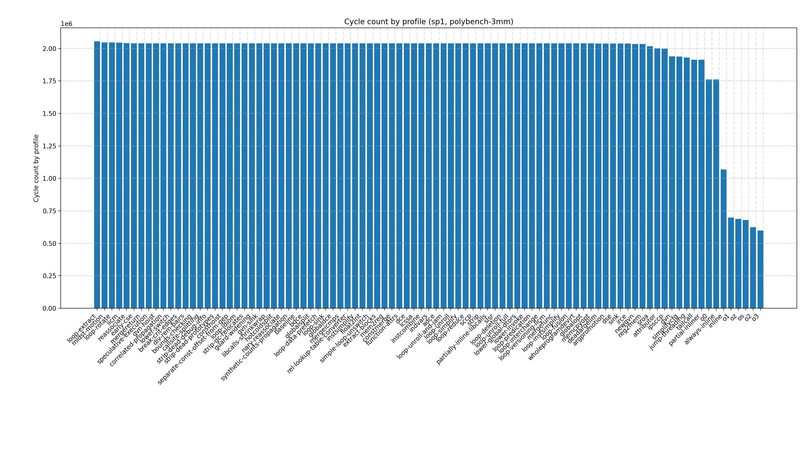
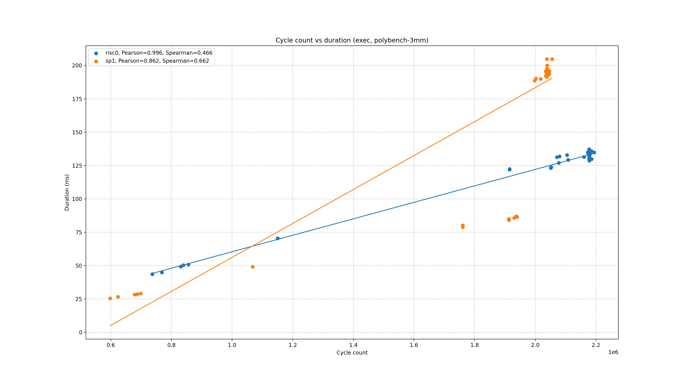
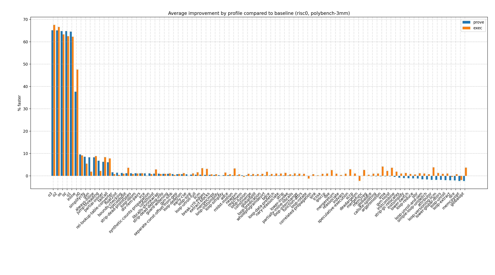
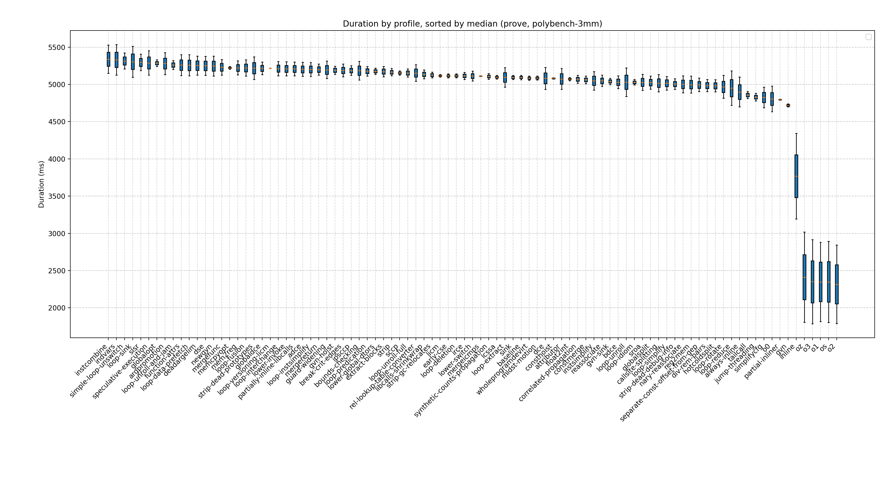
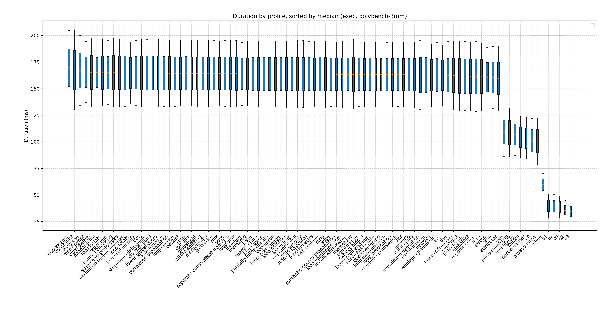

# polybench-3mm report

## Groups

- [polybench](../program-groups/polybench.md)
- [rust](../program-groups/rust.md)

## Speedup by profile
  

## Cycle count by profile

### Cycle count by profile (risc0)
  

### Cycle count by profile (sp1)
  

### Cycle count relation to measurement

#### Cycle count vs. prove
  

#### Cycle count vs. exec
  

## % faster
  

### risc0 % faster
  

### sp1 % faster
  

## Duration

### prove duration
  

#### risc0 prove duration
  

#### sp1 prove duration
  

### exec duration
  

#### risc0 exec duration
  

#### sp1 exec duration
  

## Prove vs. exec duration
  
