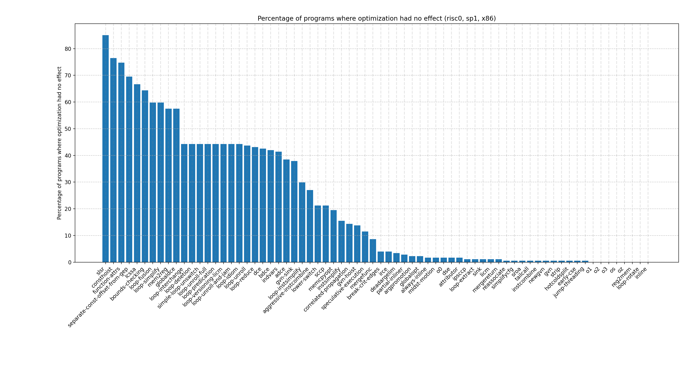
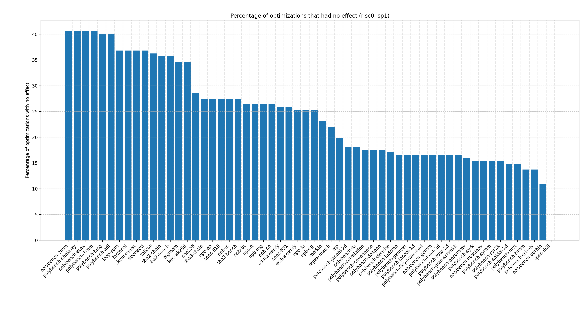
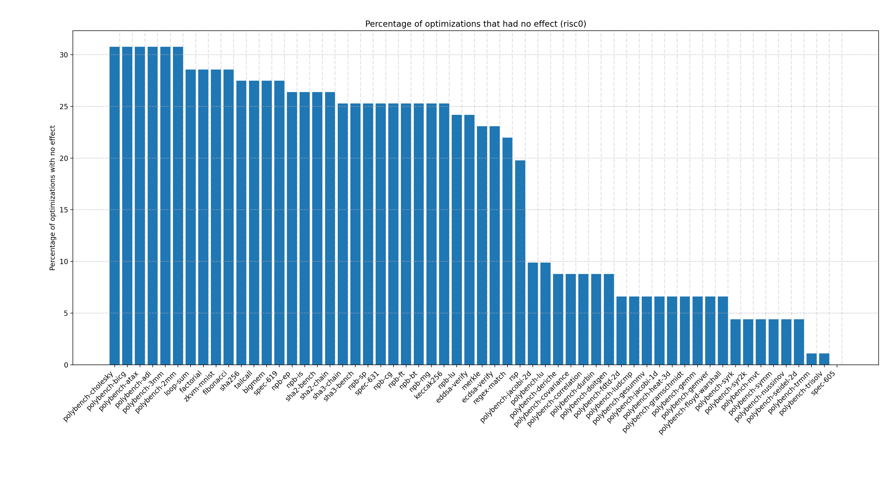
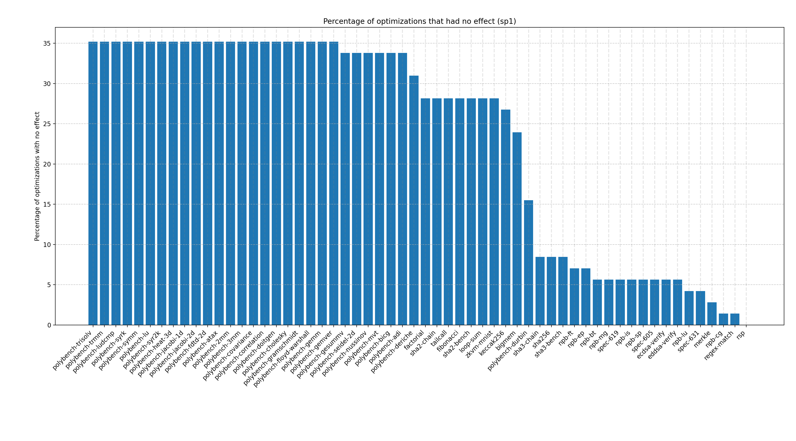
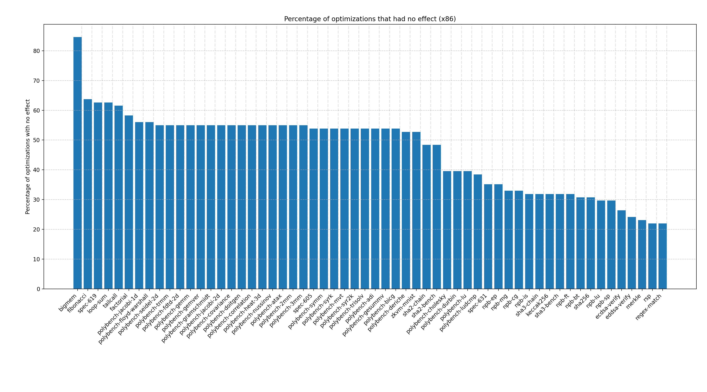

# Profiles overview

## All profiles

- [baseline](./profiles/baseline.md)
- [always-inline](./profiles/always-inline.md)
- [argpromotion](./profiles/argpromotion.md)
- [attributor](./profiles/attributor.md)
- [bdce](./profiles/bdce.md)
- [correlated-propagation](./profiles/correlated-propagation.md)
- [globaldce](./profiles/globaldce.md)
- [globalopt](./profiles/globalopt.md)
- [ipsccp](./profiles/ipsccp.md)
- [inline](./profiles/inline.md)
- [loop-extract](./profiles/loop-extract.md)
- [loop-fusion](./profiles/loop-fusion.md)
- [loop-instsimplify](./profiles/loop-instsimplify.md)
- [loop-interchange](./profiles/loop-interchange.md)
- [loop-predication](./profiles/loop-predication.md)
- [loop-versioning-licm](./profiles/loop-versioning-licm.md)
- [mergefunc](./profiles/mergefunc.md)
- [mldst-motion](./profiles/mldst-motion.md)
- [newgvn](./profiles/newgvn.md)
- [partial-inliner](./profiles/partial-inliner.md)
- [sroa](./profiles/sroa.md)
- [sink](./profiles/sink.md)
- [speculative-execution](./profiles/speculative-execution.md)
- [slsr](./profiles/slsr.md)
- [strip](./profiles/strip.md)
- [sccp](./profiles/sccp.md)
- [gvn](./profiles/gvn.md)
- [tailcall](./profiles/tailcall.md)
- [adce](./profiles/adce.md)
- [dse](./profiles/dse.md)
- [indvars](./profiles/indvars.md)
- [instcombine](./profiles/instcombine.md)
- [aggressive-instcombine](./profiles/aggressive-instcombine.md)
- [jump-threading](./profiles/jump-threading.md)
- [lcssa](./profiles/lcssa.md)
- [loop-reduce](./profiles/loop-reduce.md)
- [loop-rotate](./profiles/loop-rotate.md)
- [loop-simplify](./profiles/loop-simplify.md)
- [loop-unroll](./profiles/loop-unroll.md)
- [loop-unroll-and-jam](./profiles/loop-unroll-and-jam.md)
- [loop-unroll-full](./profiles/loop-unroll-full.md)
- [licm](./profiles/licm.md)
- [loop-deletion](./profiles/loop-deletion.md)
- [memcpyopt](./profiles/memcpyopt.md)
- [simplifycfg](./profiles/simplifycfg.md)
- [reassociate](./profiles/reassociate.md)
- [mem2reg](./profiles/mem2reg.md)
- [reg2mem](./profiles/reg2mem.md)
- [simple-loop-unswitch](./profiles/simple-loop-unswitch.md)
- [mergereturn](./profiles/mergereturn.md)
- [break-crit-edges](./profiles/break-crit-edges.md)
- [dce](./profiles/dce.md)
- [deadargelim](./profiles/deadargelim.md)
- [function-attrs](./profiles/function-attrs.md)
- [lower-switch](./profiles/lower-switch.md)
- [bounds-checking](./profiles/bounds-checking.md)
- [consthoist](./profiles/consthoist.md)
- [early-cse](./profiles/early-cse.md)
- [gvn-hoist](./profiles/gvn-hoist.md)
- [gvn-sink](./profiles/gvn-sink.md)
- [hotcoldsplit](./profiles/hotcoldsplit.md)
- [irce](./profiles/irce.md)
- [instsimplify](./profiles/instsimplify.md)
- [loop-idiom](./profiles/loop-idiom.md)
- [separate-const-offset-from-gep](./profiles/separate-const-offset-from-gep.md)
- [o0](./profiles/o0.md)
- [o1](./profiles/o1.md)
- [o2](./profiles/o2.md)
- [o3](./profiles/o3.md)
- [os](./profiles/os.md)
- [oz](./profiles/oz.md)

## Optimizations by percentage where they had any effect
  

## Percentage of optimizations that had no effect by program
  

### Percentage of optimizations that had no effect by program risc0
  

### Percentage of optimizations that had no effect by program sp1
  

### Percentage of optimizations that had no effect by program x86
  
