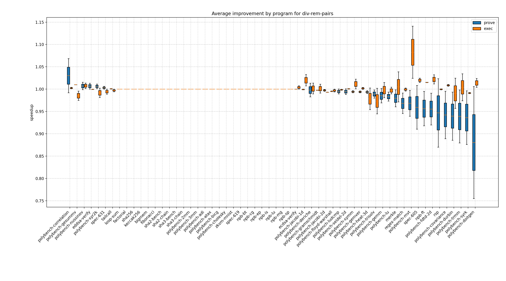
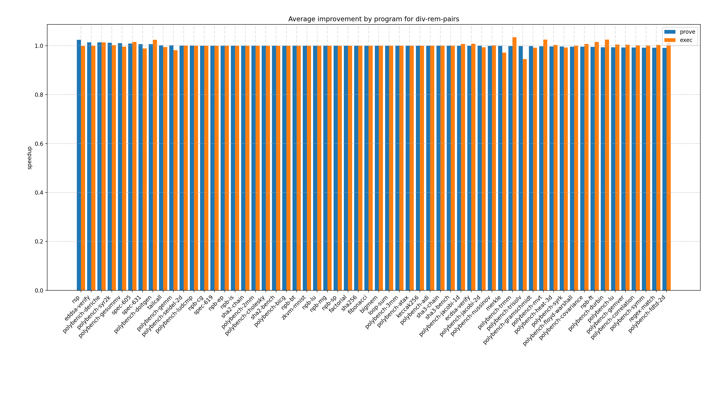
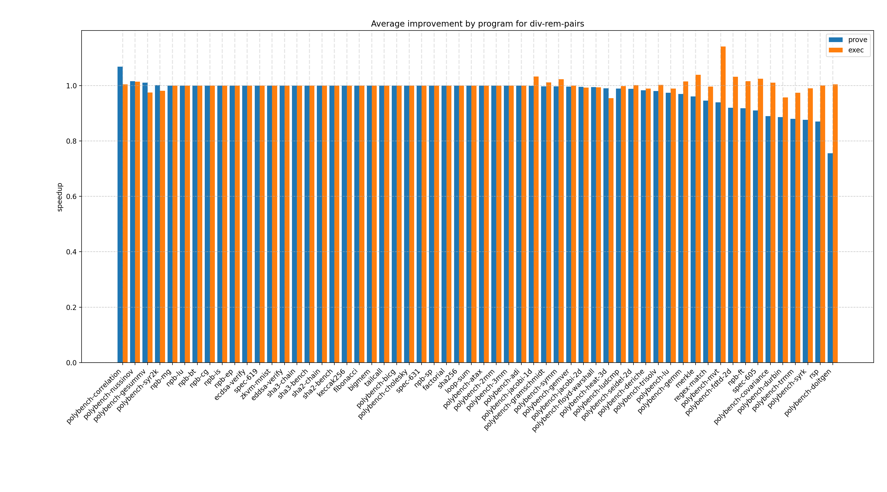

# div-rem-pairs report

## Optimization by program

### % faster
  

#### Optimization by program (risc0, % faster)
  

#### Optimization by program (sp1, % faster)
  

### Speedup
  

#### Optimization by program (risc0, Speedup)
  

#### Optimization by program (sp1, Speedup)
  
