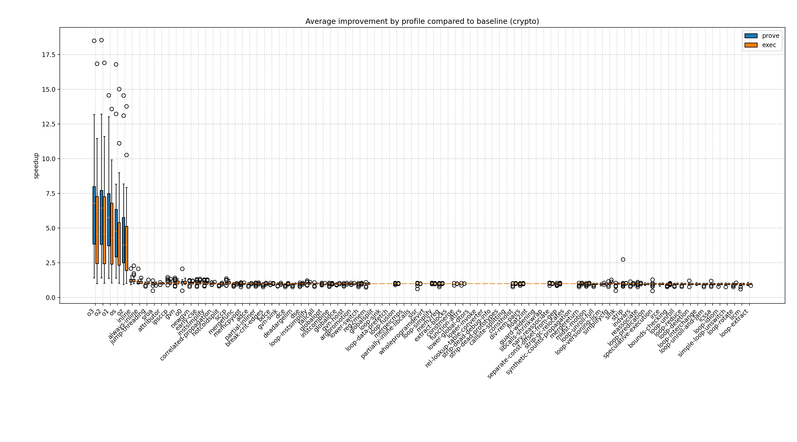
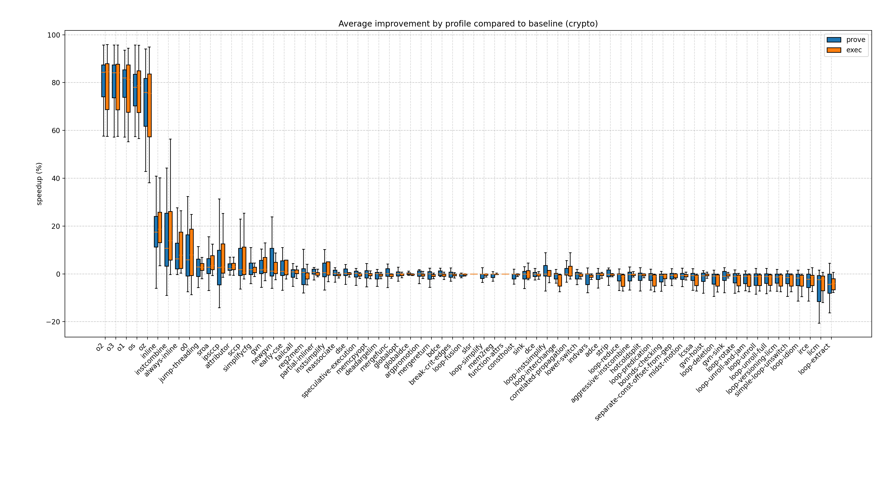
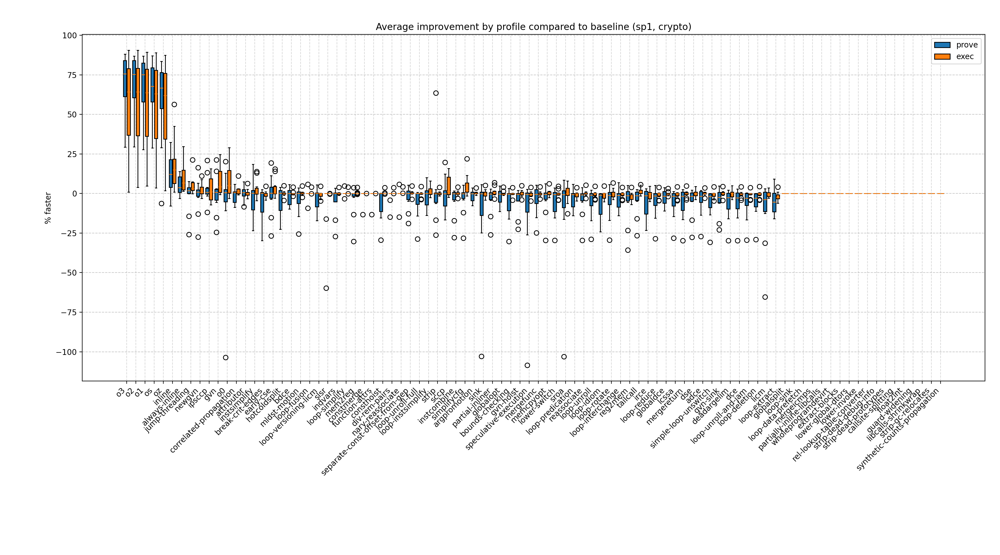
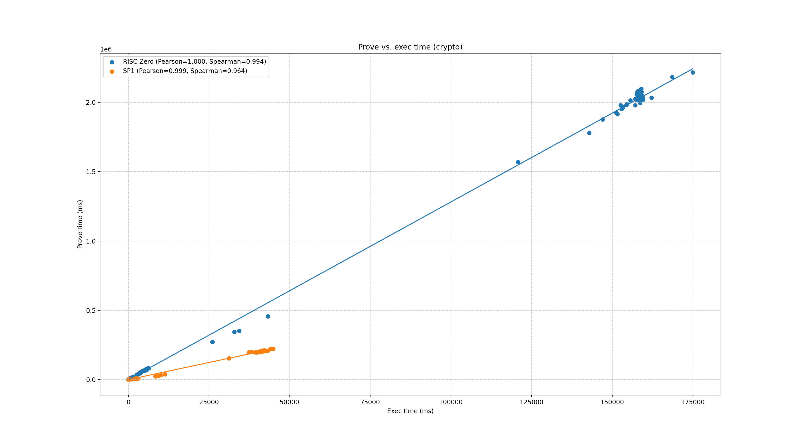

# crypto report

## Programs

- [sha256](../programs/sha256.md)
- [keccak256](../programs/keccak256.md)
- [sha2-bench](../programs/sha2-bench.md)
- [sha2-chain](../programs/sha2-chain.md)
- [sha3-bench](../programs/sha3-bench.md)
- [sha3-chain](../programs/sha3-chain.md)
- [merkle](../programs/merkle.md)
- [ecdsa-verify](../programs/ecdsa-verify.md)
- [eddsa-verify](../programs/eddsa-verify.md)
- [rsp](../programs/rsp.md)

## Speedup by profile
  

## % faster
  

### risc0 % faster
  

### sp1 % faster
  

## Prove vs. exec duration
  
