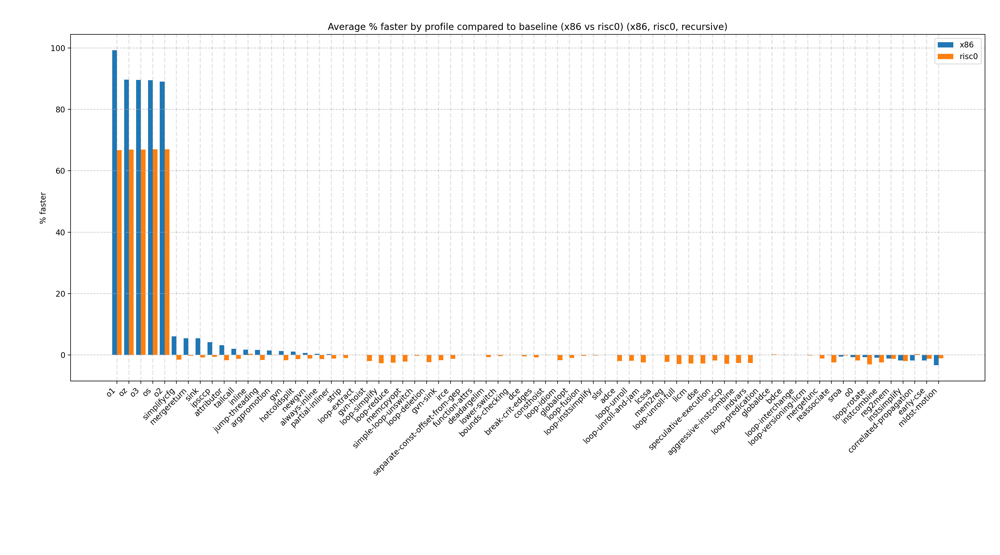
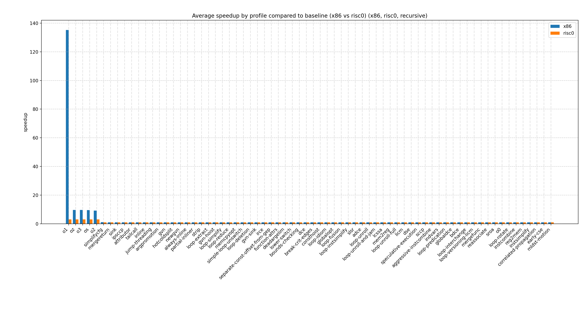
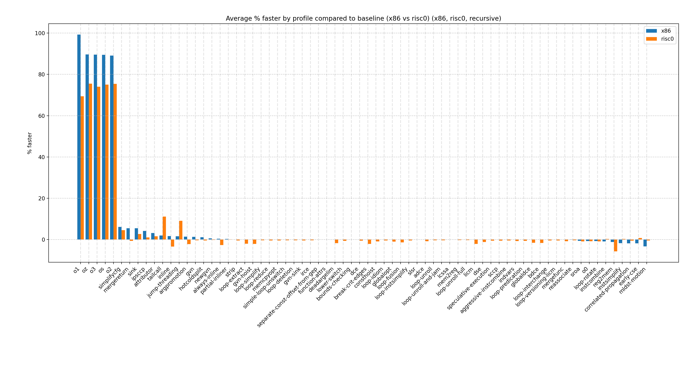
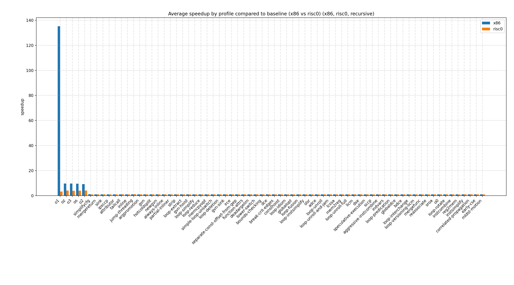
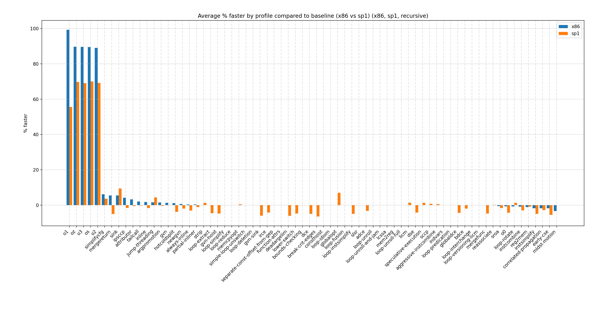
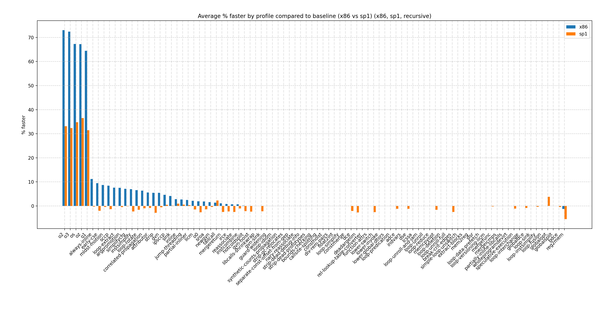
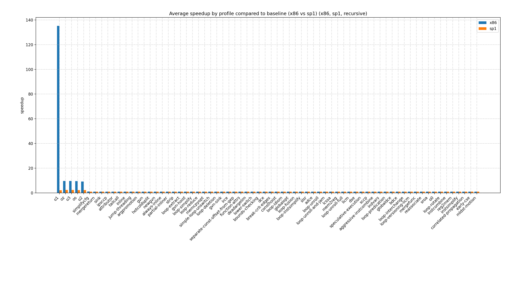

# recursive report

## Programs

- [tailcall](../programs/tailcall.md)

## Speedup by profile
  

## % faster
  

### risc0 % faster
  

### sp1 % faster
  

## Prove vs. exec duration
  

## Comparisons of average improvement

### Average improvement x86 exec vs. risc0-prove
  
  

### Average improvement x86 exec vs. risc0-exec
  
  

### Average improvement x86 exec vs. sp1-prove
  
  

### Average improvement x86 exec vs. sp1-exec
  
  
