# spec report

## Programs

- [spec-605](../programs/spec-605.md)
- [spec-619](../programs/spec-619.md)
- [spec-631](../programs/spec-631.md)

## Speedup by profile
  
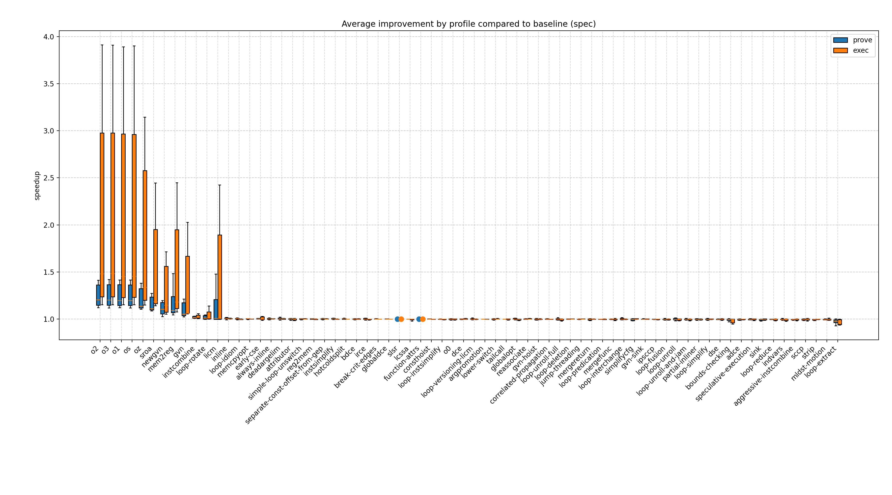
## % faster
  
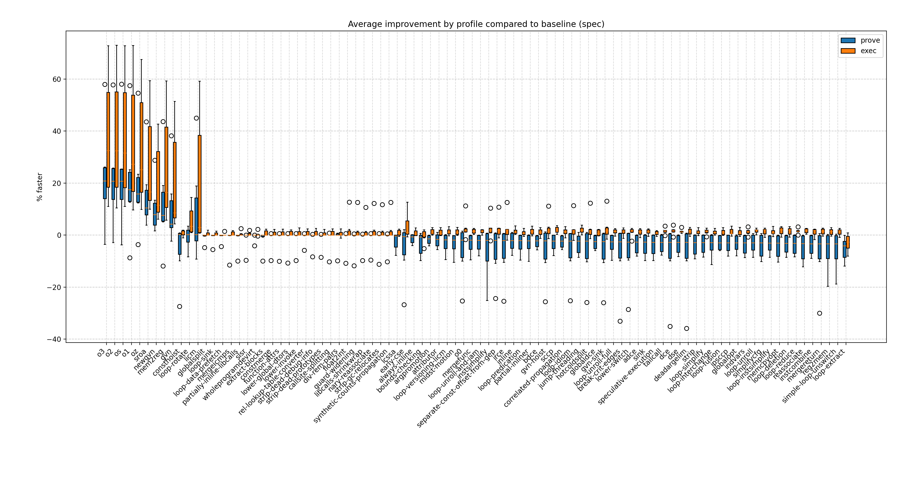
### risc0 % faster
  
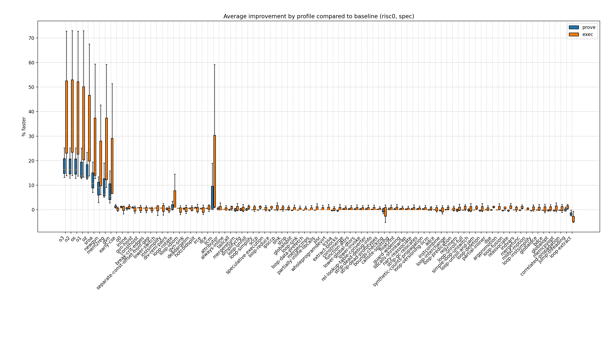
### sp1 % faster
  
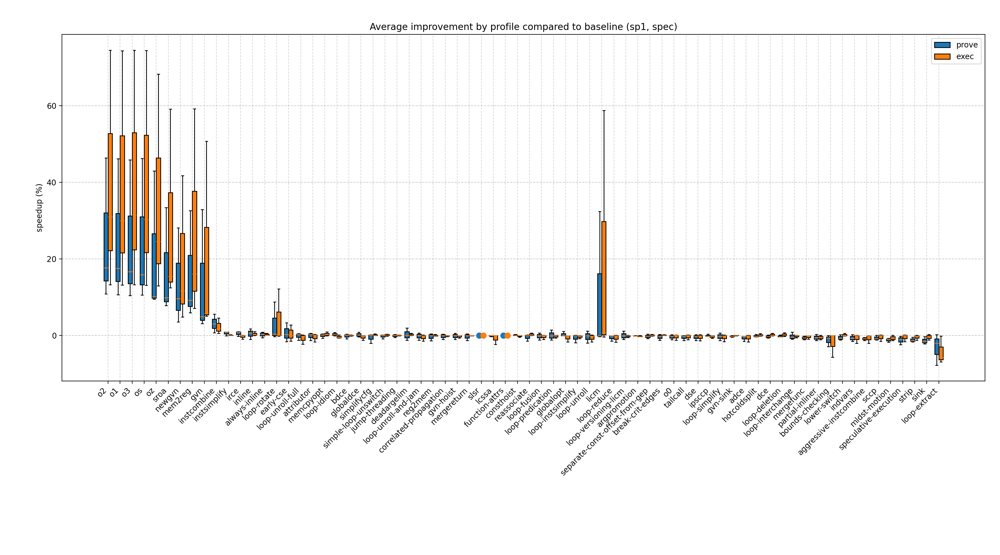
## Prove vs. exec duration
  
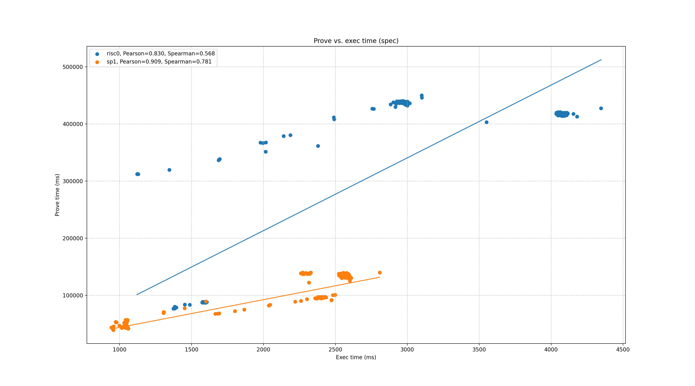
## Comparisons of average improvement

### Average improvement x86 exec vs. risc0-prove
  
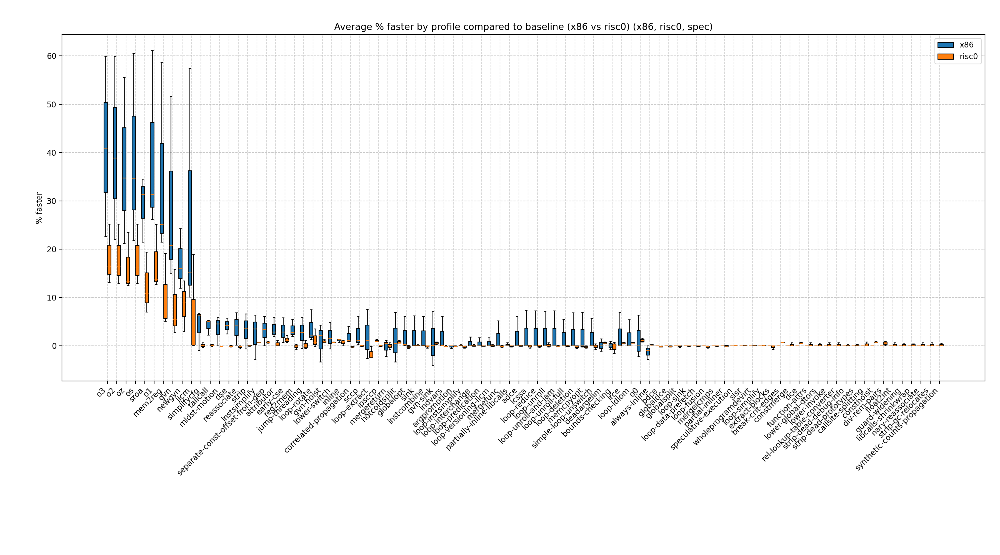  
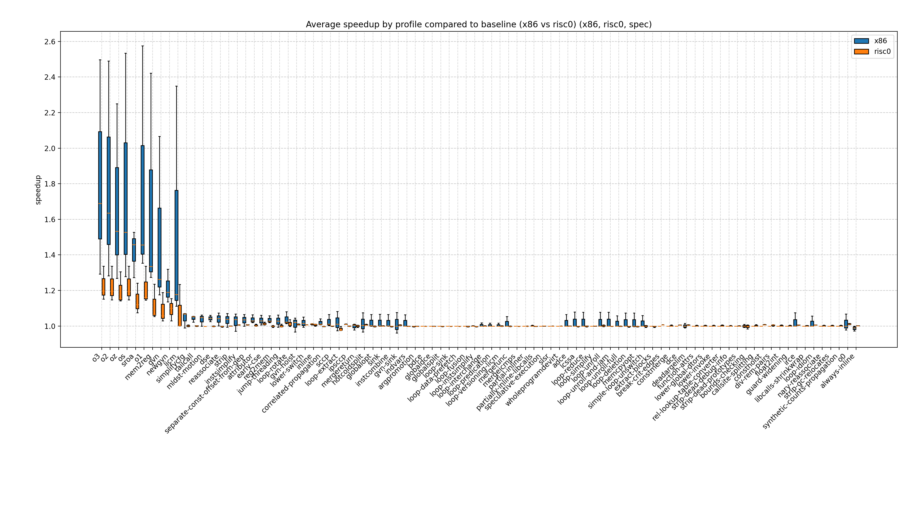
### Average improvement x86 exec vs. risc0-exec
  
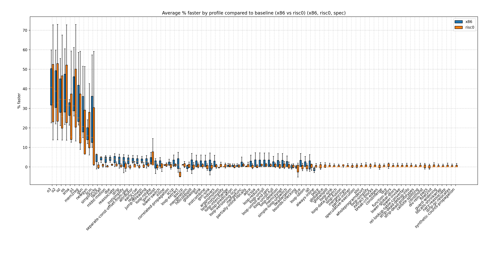  
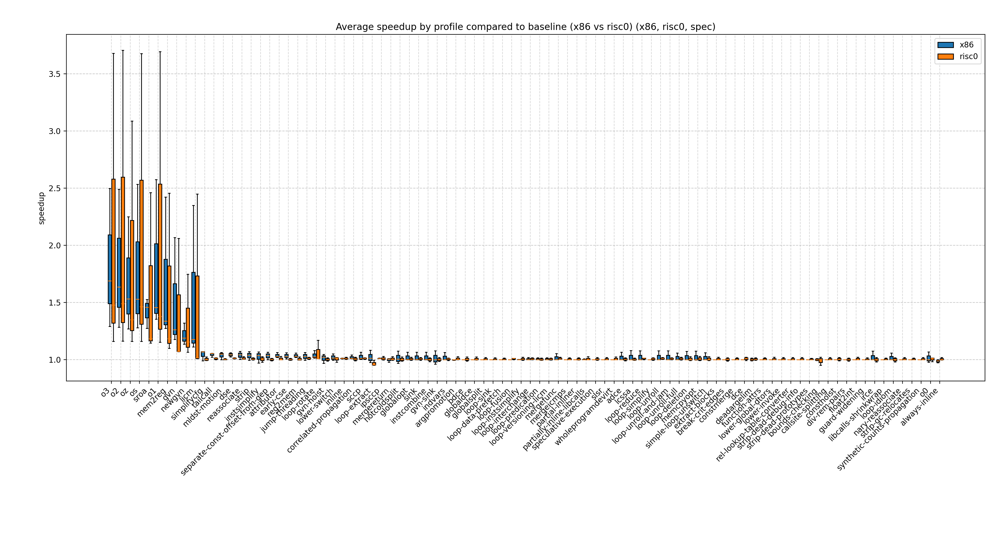
### Average improvement x86 exec vs. sp1-prove
  
  
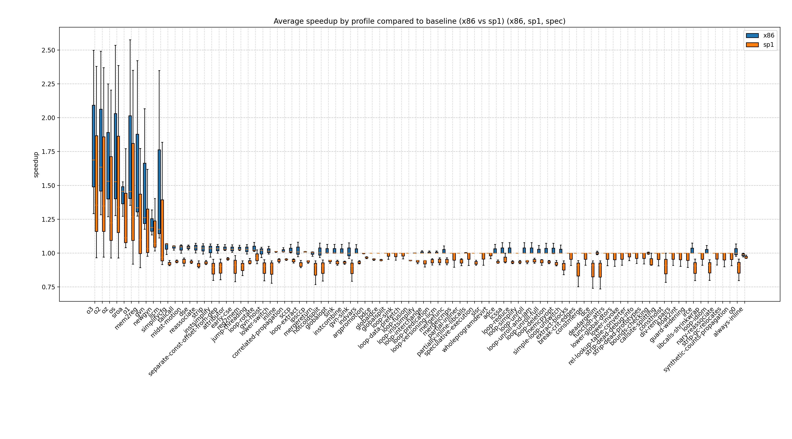
### Average improvement x86 exec vs. sp1-exec
  
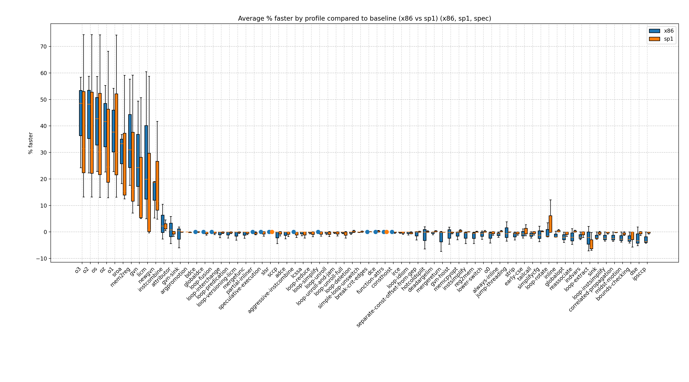  
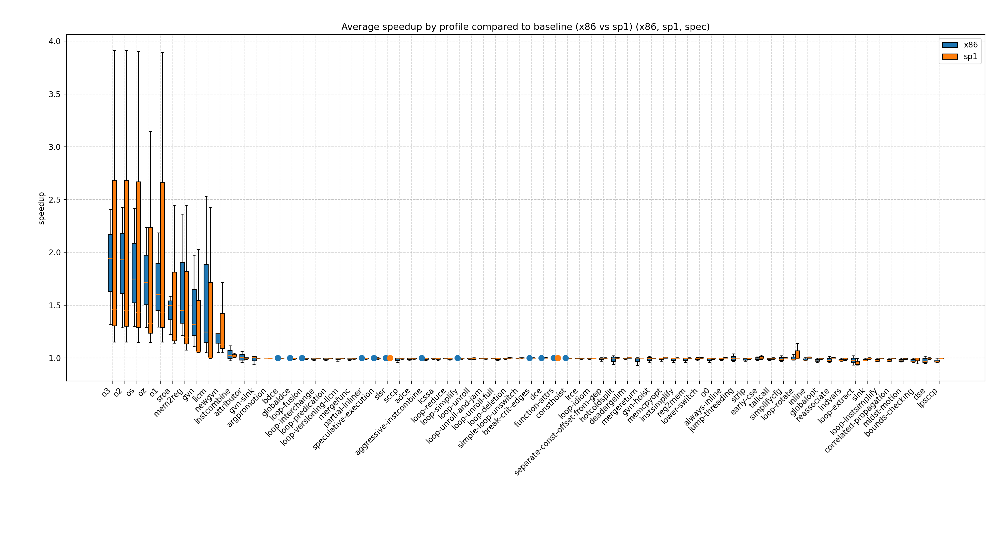