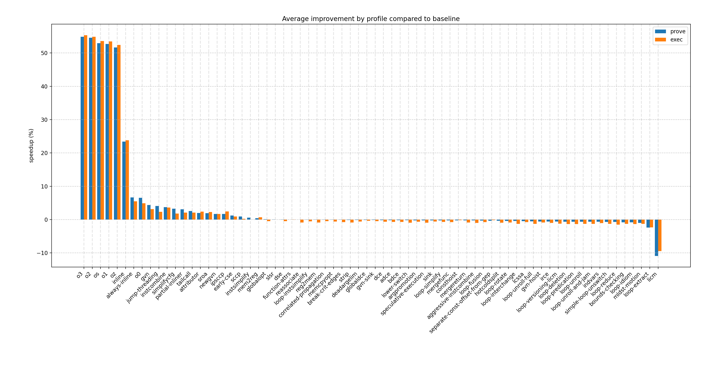
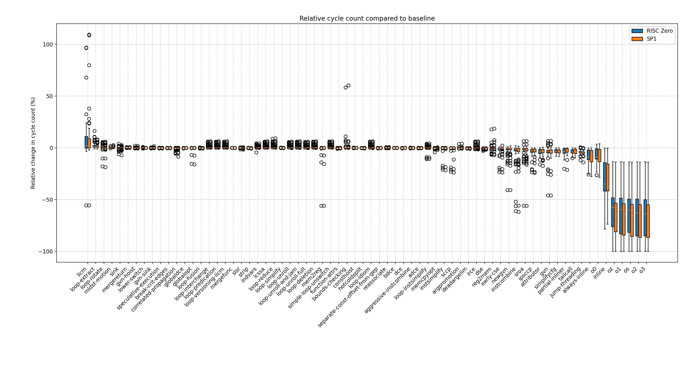
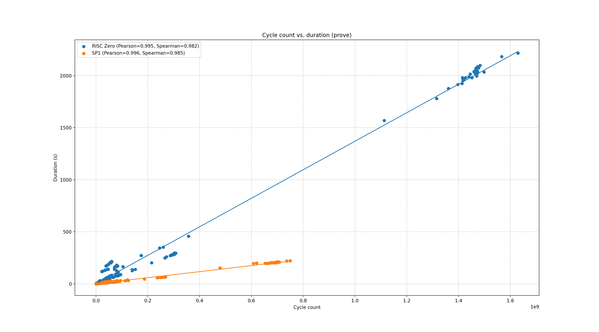
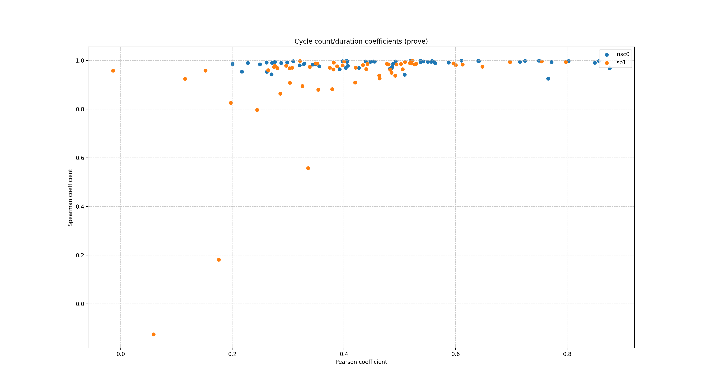
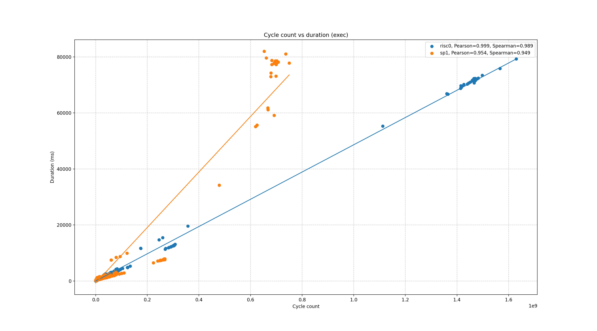
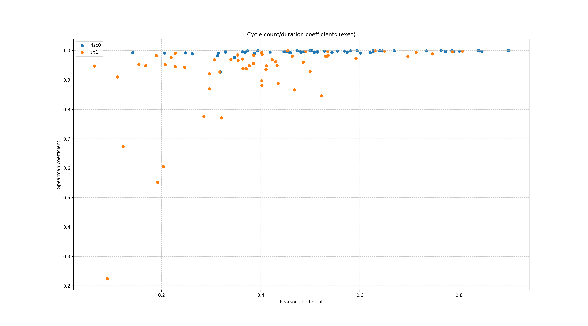
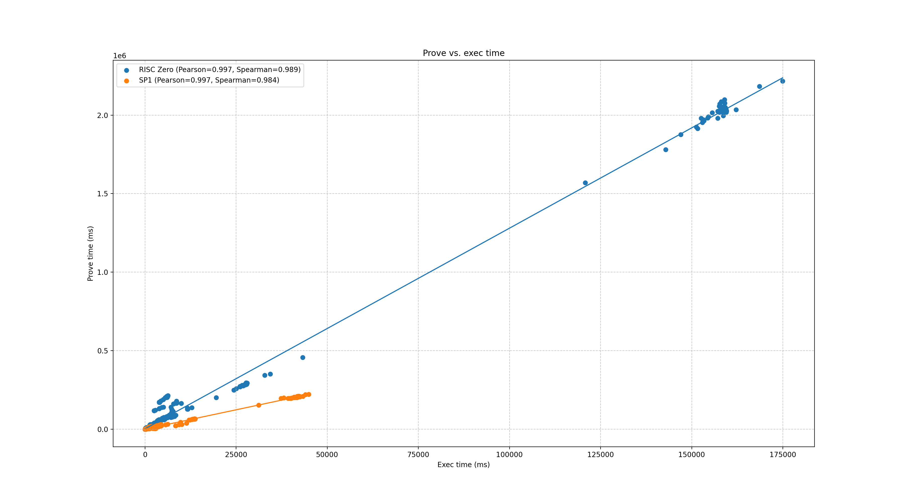

# Program overview

## Programs

- [loop-sum](./programs/loop-sum.md)
- [factorial](./programs/factorial.md)
- [sha256](./programs/sha256.md)
- [keccak256](./programs/keccak256.md)
- [tailcall](./programs/tailcall.md)
- [bigmem](./programs/bigmem.md)
- [fibonacci](./programs/fibonacci.md)
- [sha2-bench](./programs/sha2-bench.md)
- [sha2-chain](./programs/sha2-chain.md)
- [regex-match](./programs/regex-match.md)
- [sha3-bench](./programs/sha3-bench.md)
- [sha3-chain](./programs/sha3-chain.md)
- [polybench-2mm](./programs/polybench-2mm.md)
- [polybench-3mm](./programs/polybench-3mm.md)
- [polybench-adi](./programs/polybench-adi.md)
- [polybench-atax](./programs/polybench-atax.md)
- [polybench-bicg](./programs/polybench-bicg.md)
- [polybench-cholesky](./programs/polybench-cholesky.md)
- [polybench-correlation](./programs/polybench-correlation.md)
- [polybench-covariance](./programs/polybench-covariance.md)
- [polybench-deriche](./programs/polybench-deriche.md)
- [polybench-doitgen](./programs/polybench-doitgen.md)
- [polybench-durbin](./programs/polybench-durbin.md)
- [polybench-fdtd-2d](./programs/polybench-fdtd-2d.md)
- [polybench-floyd-warshall](./programs/polybench-floyd-warshall.md)
- [polybench-gemm](./programs/polybench-gemm.md)
- [polybench-gemver](./programs/polybench-gemver.md)
- [polybench-gesummv](./programs/polybench-gesummv.md)
- [polybench-gramschmidt](./programs/polybench-gramschmidt.md)
- [polybench-heat-3d](./programs/polybench-heat-3d.md)
- [polybench-jacobi-1d](./programs/polybench-jacobi-1d.md)
- [polybench-jacobi-2d](./programs/polybench-jacobi-2d.md)
- [polybench-lu](./programs/polybench-lu.md)
- [polybench-ludcmp](./programs/polybench-ludcmp.md)
- [polybench-mvt](./programs/polybench-mvt.md)
- [polybench-nussinov](./programs/polybench-nussinov.md)
- [polybench-seidel-2d](./programs/polybench-seidel-2d.md)
- [polybench-symm](./programs/polybench-symm.md)
- [polybench-syr2k](./programs/polybench-syr2k.md)
- [polybench-syrk](./programs/polybench-syrk.md)
- [polybench-trisolv](./programs/polybench-trisolv.md)
- [polybench-trmm](./programs/polybench-trmm.md)
- [merkle](./programs/merkle.md)
- [ecdsa-verify](./programs/ecdsa-verify.md)
- [eddsa-verify](./programs/eddsa-verify.md)
- [rsp](./programs/rsp.md)
- [zkvm-mnist](./programs/zkvm-mnist.md)
- [spec-605](./programs/spec-605.md)
- [spec-619](./programs/spec-619.md)
- [npb-bt](./programs/npb-bt.md)
- [npb-cg](./programs/npb-cg.md)
- [npb-ep](./programs/npb-ep.md)
- [npb-ft](./programs/npb-ft.md)
- [npb-is](./programs/npb-is.md)
- [npb-lu](./programs/npb-lu.md)
- [npb-mg](./programs/npb-mg.md)
- [npb-sp](./programs/npb-sp.md)
- [spec-631](./programs/spec-631.md)

## Program groups

- [rust](./program-groups/rust.md)
- [polybench](./program-groups/polybench.md)
- [spec](./program-groups/spec.md)
- [c](./program-groups/c.md)
- [npb](./program-groups/npb.md)
- [crypto](./program-groups/crypto.md)
- [recursive](./program-groups/recursive.md)
- [loop-intensive](./program-groups/loop-intensive.md)
- [memory-intensive](./program-groups/memory-intensive.md)

## % faster by profile
  

## Cycle count
  

### Cycle count vs. prove
  

### Cycle count vs. prove (pearson vs. spearman)
  

### Cycle count vs. exec
  

### Cycle count vs. exec (pearson vs. spearman)
  

## Prove vs. exec duration
  
