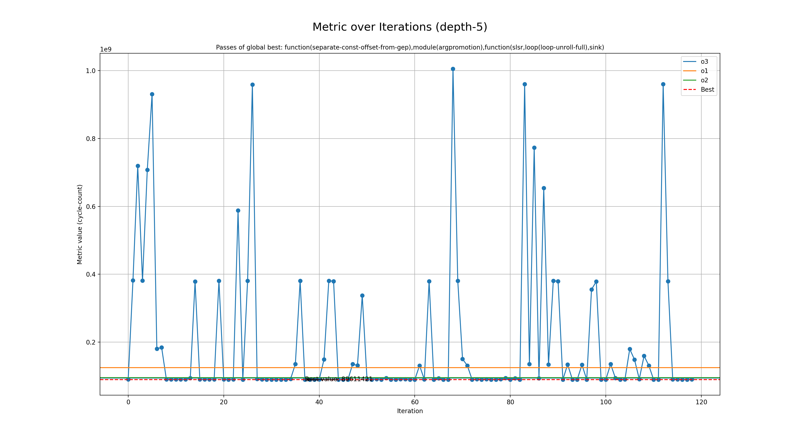

# Genetic run for metric cycle-count

## Programs

- rsp

## zkVMs

- sp1

## Best profile

- Best profile: ProfileConfig(name='genetic', lto='fat', single_codegen_unit=False, opt_level='3', prepopulate_passes=True, passes=['function(separate-const-offset-from-gep),module(argpromotion),function(slsr,loop(loop-unroll-full),sink)'])
- Metric: 89611421
- Mode: depth-5
- Tune config: ProfileConfig(name='genetic', lto='fat', single_codegen_unit=False, opt_level='3', prepopulate_passes=True, passes=['function(separate-const-offset-from-gep),module(argpromotion),function(slsr,loop(loop-unroll-full),sink)'])

## Overview
  

## Baseline values

- o3: [MetricValue(zkvm='sp1', program='rsp', metric=94400775, timeout=False)]
- o1: [MetricValue(zkvm='sp1', program='rsp', metric=125230642, timeout=False)]
- o2: [MetricValue(zkvm='sp1', program='rsp', metric=95242570, timeout=False)]
