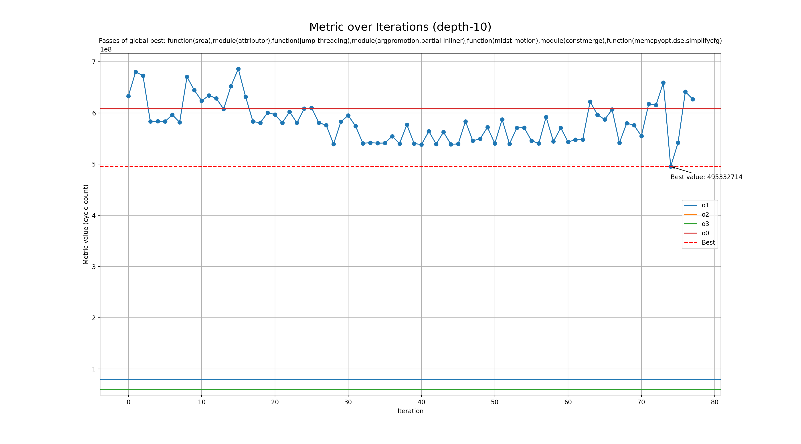

# Genetic run for metric cycle-count

## Programs

- rsp

## zkVMs

- risc0
- sp1

## Best profile

- Best profile: ProfileConfig(name='genetic', lto='off', single_codegen_unit=False, opt_level='0', prepopulate_passes=False, passes=['function(sroa),module(attributor),function(jump-threading),module(argpromotion,partial-inliner),function(mldst-motion),module(constmerge),function(memcpyopt,dse,simplifycfg)'])
- Metric: 1708481415
- Mode: depth-10
- Tune config: ProfileConfig(name='genetic', lto='off', single_codegen_unit=False, opt_level='0', prepopulate_passes=False, passes=['function(sroa),module(attributor),function(jump-threading),module(argpromotion,partial-inliner),function(mldst-motion),module(constmerge),function(memcpyopt,dse,simplifycfg)'])

## Overview
  

## Overview by zkVM

### zkVM risc0
  

### zkVM sp1
  

## Baseline values

- o1: [MetricValue(zkvm='risc0', program='rsp', metric=245506510, timeout=False), MetricValue(zkvm='sp1', program='rsp', metric=79297760, timeout=False)]
- o2: [MetricValue(zkvm='risc0', program='rsp', metric=174657862, timeout=False), MetricValue(zkvm='sp1', program='rsp', metric=60215376, timeout=False)]
- o3: [MetricValue(zkvm='risc0', program='rsp', metric=174059108, timeout=False), MetricValue(zkvm='sp1', program='rsp', metric=59701115, timeout=False)]
- o0: [MetricValue(zkvm='risc0', program='rsp', metric=1315489080, timeout=False), MetricValue(zkvm='sp1', program='rsp', metric=607831175, timeout=False)]
