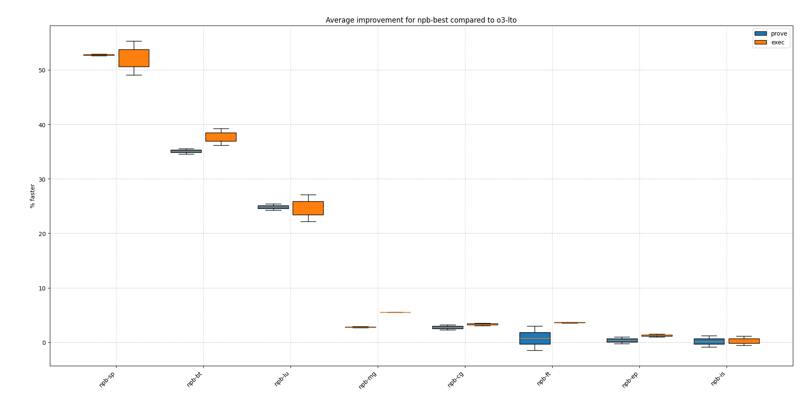
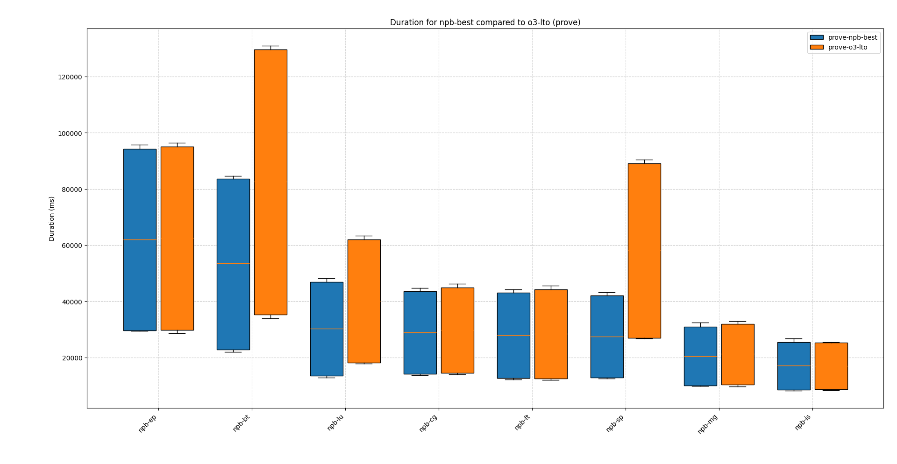
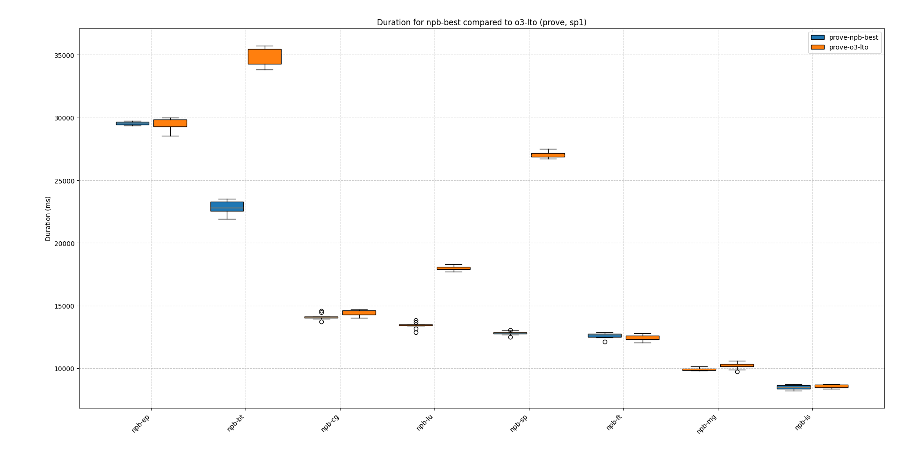
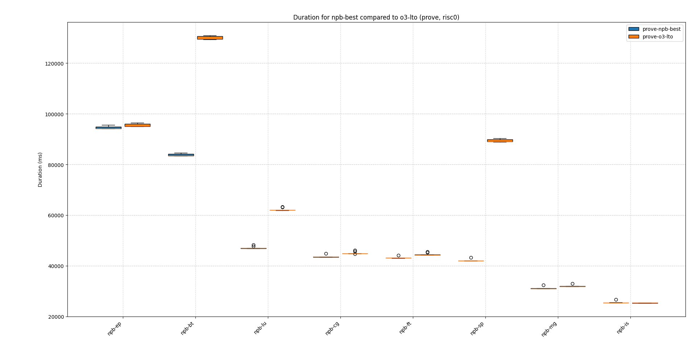
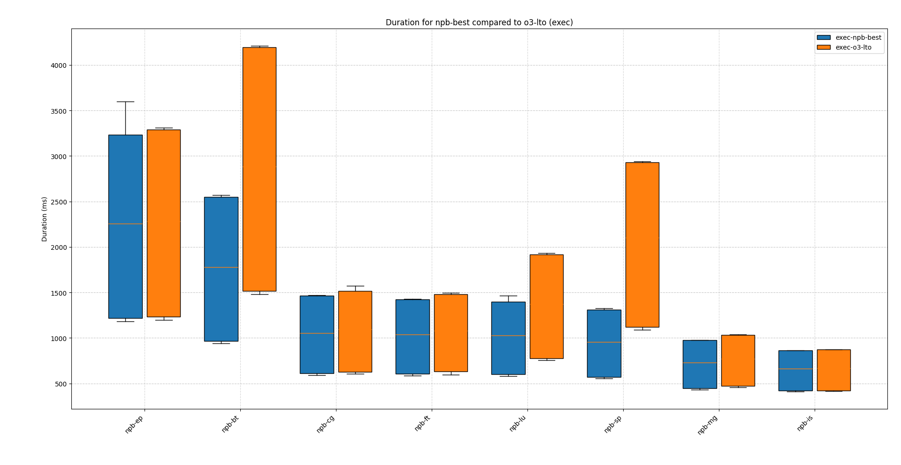
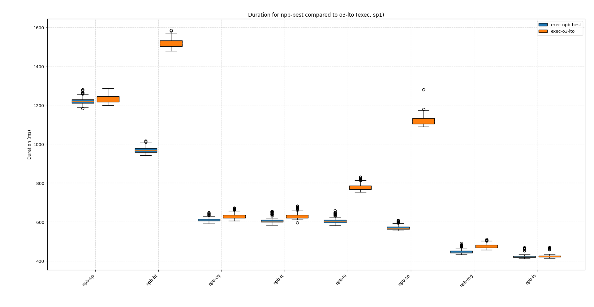
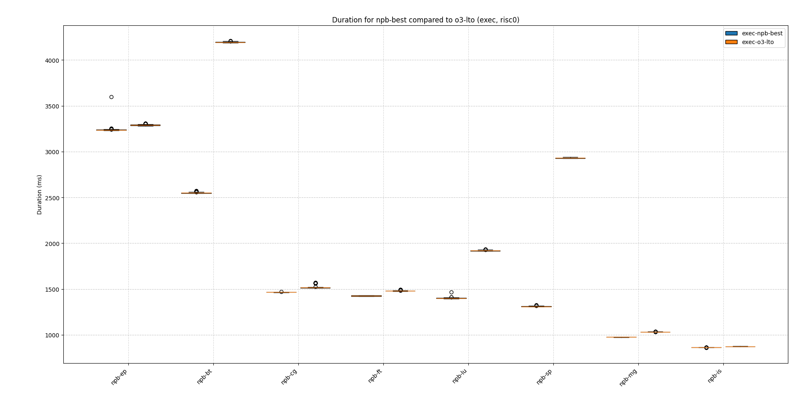

# npb

Run is documented [here](./report/all-npb-cycle-count/README.md).

## Improvement by program

### percentage

### speedup

## Duration by program

### prove

#### prove duration sp1

#### prove duration risc0

### exec

#### exec duration sp1

#### exec duration risc0

## Cycle counts

