# Genetic run for metric cycle-count

## Programs

- npb-bt
- npb-cg
- npb-ep
- npb-ft
- npb-is
- npb-lu
- npb-mg
- npb-sp

## zkVMs

- risc0
- sp1

## Best profile

- Best profile: Profile(profile_name='genetic', rustflags='-C opt-level=3 -C lto=fat -C embed-bitcode -C codegen-units=1 -Cllvm-args=-inline-threshold=4328 -Cllvm-args=-jump-threading-implication-search-threshold=8 -Cllvm-args=-licm-versioning-max-depth-threshold=1 -Cllvm-args=-max-nested-scalar-reduction-interleave=2 -Cllvm-args=-max-speculation-depth=1 -Cllvm-args=-max-uses-for-sinking=47 -Cllvm-args=-memdep-block-number-limit=1121 -Cllvm-args=-memdep-block-scan-limit=276', cflags='-O3 -mllvm -inline-threshold=4328 -mllvm -jump-threading-implication-search-threshold=8 -mllvm -licm-versioning-max-depth-threshold=1 -mllvm -max-nested-scalar-reduction-interleave=2 -mllvm -max-speculation-depth=1 -mllvm -max-uses-for-sinking=47 -mllvm -memdep-block-number-limit=1121 -mllvm -memdep-block-scan-limit=276', passes=['function(lower-invoke,simplifycfg),module(rel-lookup-table-converter),function(dse,reassociate,speculative-execution,separate-const-offset-from-gep),module(always-inline),function(irce),module(inline),function(gvn),module(function-attrs,attributor),function(loop-sink,loop-mssa(licm),dse,newgvn,loop(loop-reduce),reg2mem)'], prepopulate_passes=True, lower_atomic_before=False)
- Metric: 376601659
- Mode: depth-20
- Tune config: TuneConfig(tune_lto=True, tune_codegen_units=True, tune_opt_level=True, tune_prepopulate_passes=False, module_passes=['always-inline', 'inline', 'partial-inliner', 'attributor', 'add-discriminators', 'globalsplit', 'globaldce', 'globalopt', 'wholeprogramdevirt', 'lower-global-dtors', 'strip', 'strip-dead-debug-info', 'strip-dead-prototypes', 'bounds-checking', 'loop-extract', 'mergefunc', 'extract-blocks', 'constmerge', 'deadargelim', 'function-attrs', 'strip-gc-relocates', 'hotcoldsplit', 'argpromotion', 'ipsccp', 'synthetic-counts-propagation', 'rel-lookup-table-converter', 'aggressive-instcombine'], function_passes=['loop-mssa(licm)', 'instcombine', 'bdce', 'correlated-propagation', 'loop-sink', 'loop-data-prefetch', 'loop-fusion', 'mergeicmps', 'mldst-motion', 'newgvn', 'partially-inline-libcalls', 'sroa', 'sink', 'speculative-execution', 'slsr', 'sccp', 'gvn', 'tailcallelim', 'adce', 'dse', 'indvars', 'jump-threading', 'lcssa', 'loop-unroll', 'memcpyopt', 'loop-simplify', 'simplifycfg', 'reassociate', 'mem2reg', 'reg2mem', 'simple-loop-unswitch', 'mergereturn', 'break-crit-edges', 'dce', 'lower-invoke', 'lower-switch', 'callsite-splitting', 'consthoist', 'div-rem-pairs', 'early-cse', 'float2int', 'gvn-hoist', 'gvn-sink', 'guard-widening', 'irce', 'instsimplify', 'libcalls-shrinkwrap', 'nary-reassociate', 'separate-const-offset-from-gep'], loop_passes=['loop-idiom', 'loop-reduce', 'loop-rotate', 'loop-unroll-and-jam', 'loop-unroll-full', 'loop-deletion', 'loop-instsimplify', 'loop-interchange', 'loop-predication', 'loop-versioning-licm'], allowed_opt_levels=['2', '3'], default_prepopulate_passes=True, default_single_codegen_unit=True, allowed_lto=['off', 'thin', 'fat'])

## Overview
  

## Overview by program

### Program npb-bt
  
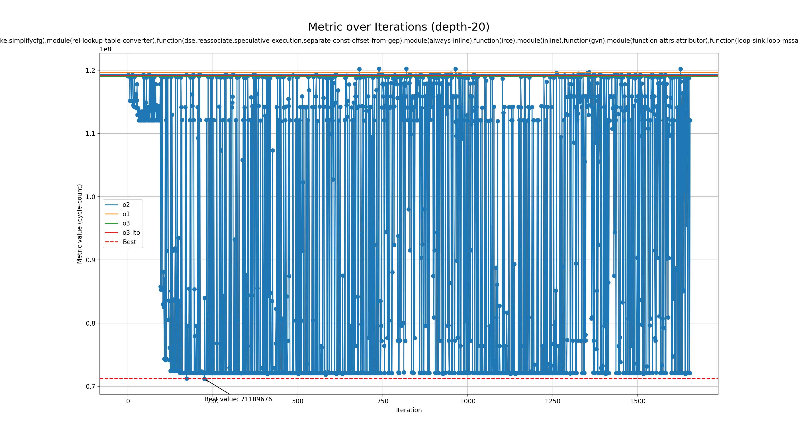
### Program npb-cg
  
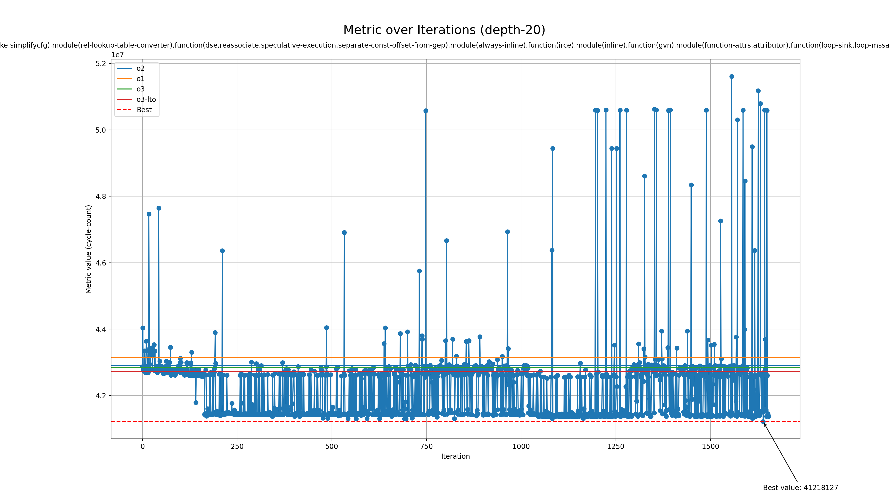
### Program npb-ep
  
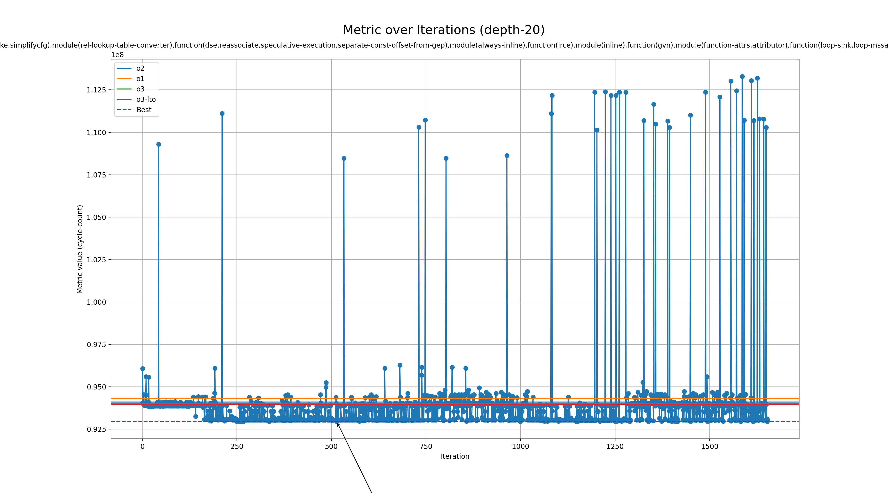
### Program npb-ft
  
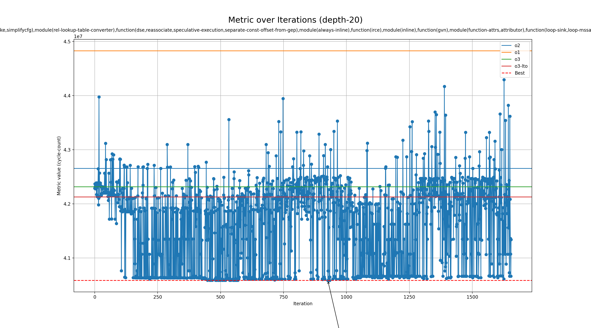
### Program npb-is
  
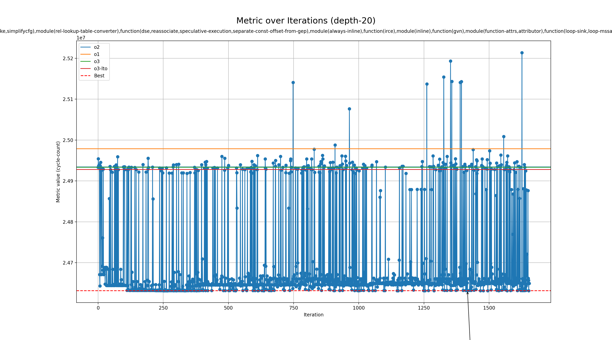
### Program npb-lu
  
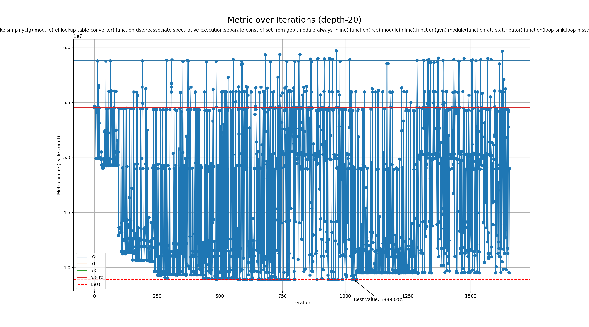
### Program npb-mg
  
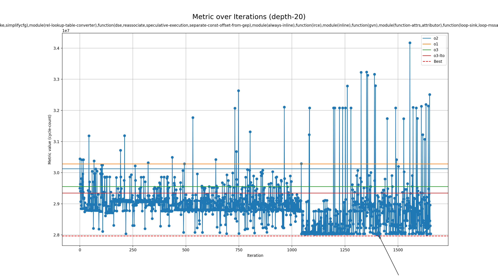
### Program npb-sp
  
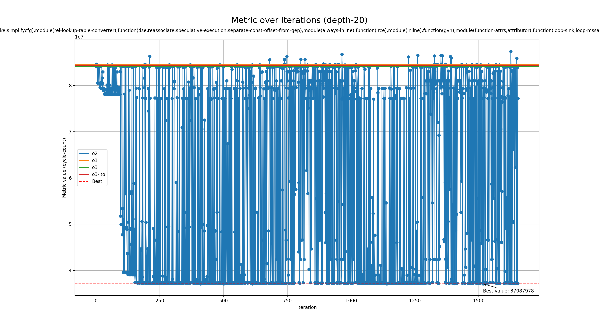
## Overview by program group

### Group loop-intensive
  

### Group npb
  
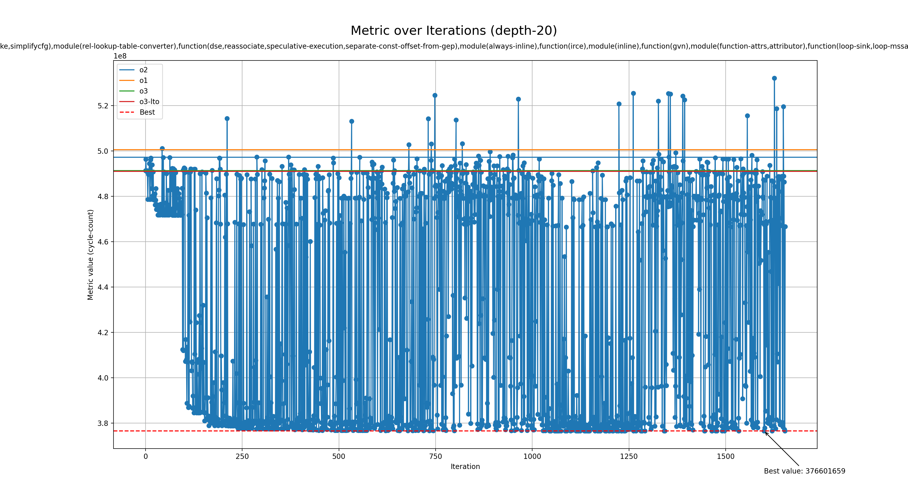
### Group memory-intensive
  

### Group rust
  

## Overview by zkVM

### zkVM risc0
  
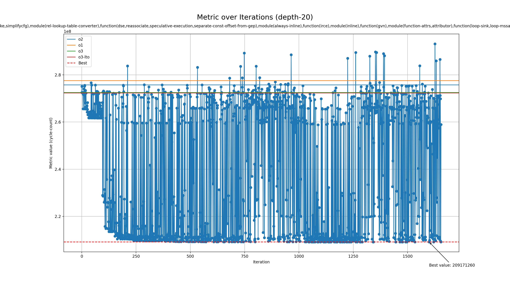
### zkVM sp1
  
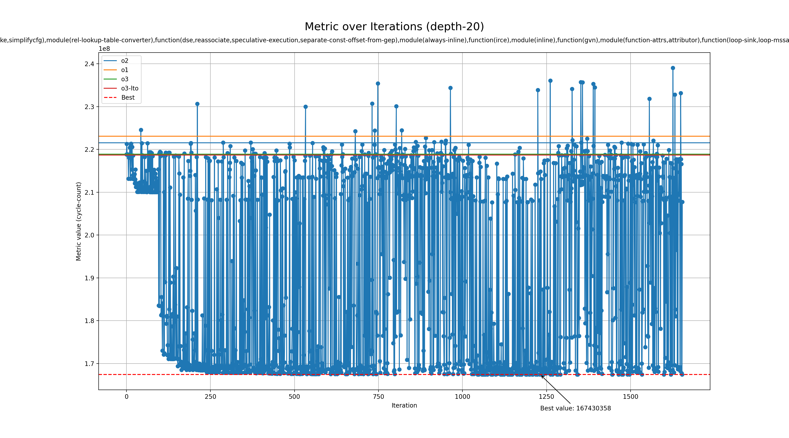
## Baseline values

- o2: [MetricValue(zkvm='risc0', program='npb-bt', metric=65971535, timeout=False), MetricValue(zkvm='risc0', program='npb-cg', metric=23708210, timeout=False), MetricValue(zkvm='risc0', program='npb-ep', metric=52388190, timeout=False), MetricValue(zkvm='risc0', program='npb-ft', metric=23677672, timeout=False), MetricValue(zkvm='risc0', program='npb-is', metric=13854988, timeout=False), MetricValue(zkvm='risc0', program='npb-lu', metric=32590599, timeout=False), MetricValue(zkvm='risc0', program='npb-mg', metric=16744787, timeout=False), MetricValue(zkvm='risc0', program='npb-sp', metric=46789644, timeout=False), MetricValue(zkvm='sp1', program='npb-bt', metric=53345974, timeout=False), MetricValue(zkvm='sp1', program='npb-cg', metric=19190281, timeout=False), MetricValue(zkvm='sp1', program='npb-ep', metric=41722254, timeout=False), MetricValue(zkvm='sp1', program='npb-ft', metric=18978175, timeout=False), MetricValue(zkvm='sp1', program='npb-is', metric=11079374, timeout=False), MetricValue(zkvm='sp1', program='npb-lu', metric=26201461, timeout=False), MetricValue(zkvm='sp1', program='npb-mg', metric=13379826, timeout=False), MetricValue(zkvm='sp1', program='npb-sp', metric=37644958, timeout=False)]
- o1: [MetricValue(zkvm='risc0', program='npb-bt', metric=66137375, timeout=False), MetricValue(zkvm='risc0', program='npb-cg', metric=23803882, timeout=False), MetricValue(zkvm='risc0', program='npb-ep', metric=52490595, timeout=False), MetricValue(zkvm='risc0', program='npb-ft', metric=24905668, timeout=False), MetricValue(zkvm='risc0', program='npb-is', metric=13877060, timeout=False), MetricValue(zkvm='risc0', program='npb-lu', metric=32610790, timeout=False), MetricValue(zkvm='risc0', program='npb-mg', metric=16821695, timeout=False), MetricValue(zkvm='risc0', program='npb-sp', metric=46881068, timeout=False), MetricValue(zkvm='sp1', program='npb-bt', metric=53494263, timeout=False), MetricValue(zkvm='sp1', program='npb-cg', metric=19340136, timeout=False), MetricValue(zkvm='sp1', program='npb-ep', metric=41824857, timeout=False), MetricValue(zkvm='sp1', program='npb-ft', metric=19921536, timeout=False), MetricValue(zkvm='sp1', program='npb-is', metric=11101596, timeout=False), MetricValue(zkvm='sp1', program='npb-lu', metric=26218227, timeout=False), MetricValue(zkvm='sp1', program='npb-mg', metric=13459342, timeout=False), MetricValue(zkvm='sp1', program='npb-sp', metric=37719051, timeout=False)]
- o3: [MetricValue(zkvm='risc0', program='npb-bt', metric=65820034, timeout=False), MetricValue(zkvm='risc0', program='npb-cg', metric=23680624, timeout=False), MetricValue(zkvm='risc0', program='npb-ep', metric=52345743, timeout=False), MetricValue(zkvm='risc0', program='npb-ft', metric=23497181, timeout=False), MetricValue(zkvm='risc0', program='npb-is', metric=13854473, timeout=False), MetricValue(zkvm='risc0', program='npb-lu', metric=30242084, timeout=False), MetricValue(zkvm='risc0', program='npb-mg', metric=16434270, timeout=False), MetricValue(zkvm='risc0', program='npb-sp', metric=46628552, timeout=False), MetricValue(zkvm='sp1', program='npb-bt', metric=53213671, timeout=False), MetricValue(zkvm='sp1', program='npb-cg', metric=19169113, timeout=False), MetricValue(zkvm='sp1', program='npb-ep', metric=41688116, timeout=False), MetricValue(zkvm='sp1', program='npb-ft', metric=18817691, timeout=False), MetricValue(zkvm='sp1', program='npb-is', metric=11078859, timeout=False), MetricValue(zkvm='sp1', program='npb-lu', metric=24284905, timeout=False), MetricValue(zkvm='sp1', program='npb-mg', metric=13117592, timeout=False), MetricValue(zkvm='sp1', program='npb-sp', metric=37503578, timeout=False)]
- o3-lto: [MetricValue(zkvm='risc0', program='npb-bt', metric=65885661, timeout=False), MetricValue(zkvm='risc0', program='npb-cg', metric=23619619, timeout=False), MetricValue(zkvm='risc0', program='npb-ep', metric=52315453, timeout=False), MetricValue(zkvm='risc0', program='npb-ft', metric=23392514, timeout=False), MetricValue(zkvm='risc0', program='npb-is', metric=13851615, timeout=False), MetricValue(zkvm='risc0', program='npb-lu', metric=30233592, timeout=False), MetricValue(zkvm='risc0', program='npb-mg', metric=16319182, timeout=False), MetricValue(zkvm='risc0', program='npb-sp', metric=46693865, timeout=False), MetricValue(zkvm='sp1', program='npb-bt', metric=53262904, timeout=False), MetricValue(zkvm='sp1', program='npb-cg', metric=19106630, timeout=False), MetricValue(zkvm='sp1', program='npb-ep', metric=41654255, timeout=False), MetricValue(zkvm='sp1', program='npb-ft', metric=18734601, timeout=False), MetricValue(zkvm='sp1', program='npb-is', metric=11076307, timeout=False), MetricValue(zkvm='sp1', program='npb-lu', metric=24273849, timeout=False), MetricValue(zkvm='sp1', program='npb-mg', metric=13024171, timeout=False), MetricValue(zkvm='sp1', program='npb-sp', metric=37552785, timeout=False)]
