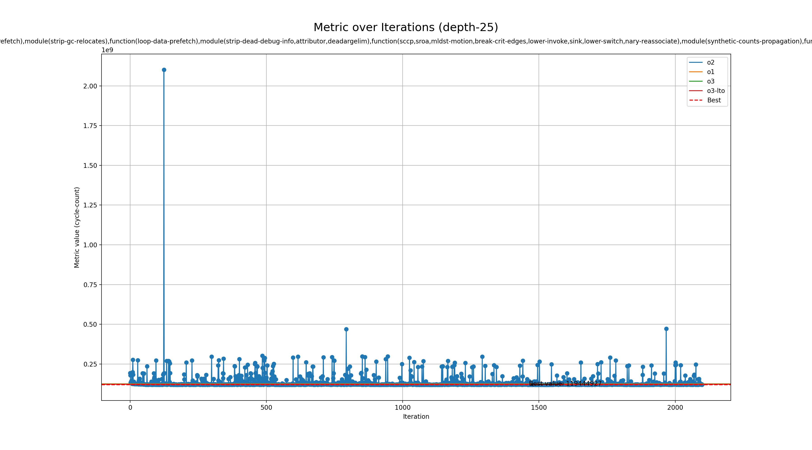

# Genetic run for metric cycle-count

## Programs

- zkvm-mnist

## zkVMs

- risc0

## Best profile

- Best profile: Profile(profile_name='genetic', rustflags='-C opt-level=3 -C lto=thin -C embed-bitcode -Cllvm-args=-available-load-scan-limit=3 -Cllvm-args=-bonus-inst-threshold=0 -Cllvm-args=-early-ifcvt-limit=77 -Cllvm-args=-inline-threshold=27838 -Cllvm-args=-jump-threading-implication-search-threshold=9 -Cllvm-args=-jump-threading-threshold=18 -Cllvm-args=-licm-max-num-uses-traversed=24 -Cllvm-args=-loop-interchange-threshold=-4 -Cllvm-args=-loop-load-elimination-scev-check-threshold=17 -Cllvm-args=-max-nested-scalar-reduction-interleave=5 -Cllvm-args=-max-speculation-depth=1 -Cllvm-args=-max-uses-for-sinking=4 -Cllvm-args=-memdep-block-number-limit=1269', cflags='-O3 -mllvm -available-load-scan-limit=3 -mllvm -bonus-inst-threshold=0 -mllvm -early-ifcvt-limit=77 -mllvm -inline-threshold=27838 -mllvm -jump-threading-implication-search-threshold=9 -mllvm -jump-threading-threshold=18 -mllvm -licm-max-num-uses-traversed=24 -mllvm -loop-interchange-threshold=-4 -mllvm -loop-load-elimination-scev-check-threshold=17 -mllvm -max-nested-scalar-reduction-interleave=5 -mllvm -max-speculation-depth=1 -mllvm -max-uses-for-sinking=4 -mllvm -memdep-block-number-limit=1269', passes=['function(correlated-propagation,slsr),module(strip-dead-debug-info),function(gvn,loop-data-prefetch),module(strip-gc-relocates),function(loop-data-prefetch),module(strip-dead-debug-info,attributor,deadargelim),function(sccp,sroa,mldst-motion,break-crit-edges,lower-invoke,sink,lower-switch,nary-reassociate),module(synthetic-counts-propagation),function(separate-const-offset-from-gep,guard-widening,mldst-motion),module(loop-extract),function(memcpyopt,mem2reg)'], prepopulate_passes=True, lower_atomic_before=False)
- Metric: 119444927
- Mode: depth-25
- Tune config: TuneConfig(tune_lto=True, tune_codegen_units=True, tune_opt_level=True, tune_prepopulate_passes=True, module_passes=['always-inline', 'inline', 'partial-inliner', 'attributor', 'add-discriminators', 'globalsplit', 'globaldce', 'globalopt', 'wholeprogramdevirt', 'lower-global-dtors', 'strip', 'strip-dead-debug-info', 'strip-dead-prototypes', 'bounds-checking', 'loop-extract', 'mergefunc', 'extract-blocks', 'constmerge', 'deadargelim', 'function-attrs', 'strip-gc-relocates', 'hotcoldsplit', 'argpromotion', 'ipsccp', 'synthetic-counts-propagation', 'rel-lookup-table-converter', 'aggressive-instcombine'], function_passes=['loop-mssa(licm)', 'instcombine', 'bdce', 'correlated-propagation', 'loop-sink', 'loop-data-prefetch', 'loop-fusion', 'mergeicmps', 'mldst-motion', 'newgvn', 'partially-inline-libcalls', 'sroa', 'sink', 'speculative-execution', 'slsr', 'sccp', 'gvn', 'tailcallelim', 'adce', 'dse', 'indvars', 'jump-threading', 'lcssa', 'loop-unroll', 'memcpyopt', 'loop-simplify', 'simplifycfg', 'reassociate', 'mem2reg', 'reg2mem', 'simple-loop-unswitch', 'mergereturn', 'break-crit-edges', 'dce', 'lower-invoke', 'lower-switch', 'callsite-splitting', 'consthoist', 'div-rem-pairs', 'early-cse', 'float2int', 'gvn-hoist', 'gvn-sink', 'guard-widening', 'irce', 'instsimplify', 'libcalls-shrinkwrap', 'nary-reassociate', 'separate-const-offset-from-gep'], loop_passes=['loop-idiom', 'loop-reduce', 'loop-rotate', 'loop-unroll-and-jam', 'loop-unroll-full', 'loop-deletion', 'loop-instsimplify', 'loop-interchange', 'loop-predication', 'loop-versioning-licm'], allowed_opt_levels=['0', '1', '2', '3', 's', 'z'], default_prepopulate_passes=True, default_single_codegen_unit=False, allowed_lto=['off', 'thin', 'fat'])

## Overview
  

## Baseline values

- o2: [MetricValue(zkvm='risc0', program='zkvm-mnist', metric=123208432, timeout=False)]
- o1: [MetricValue(zkvm='risc0', program='zkvm-mnist', metric=124423285, timeout=False)]
- o3: [MetricValue(zkvm='risc0', program='zkvm-mnist', metric=123068947, timeout=False)]
- o3-lto: [MetricValue(zkvm='risc0', program='zkvm-mnist', metric=121709356, timeout=False)]
