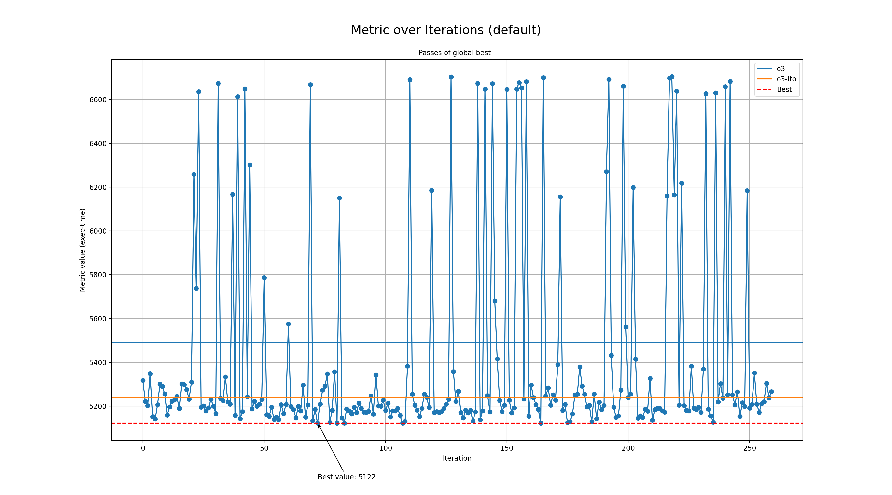

# Genetic run for metric exec-time

## Programs

- rsp

## zkVMs

- sp1

## Best profile

- Best profile: Profile(profile_name='genetic', rustflags='-C opt-level=3 -C lto=fat -C embed-bitcode -C codegen-units=1 -Cllvm-args=-early-ifcvt-limit=6 -Cllvm-args=-inline-threshold=1501 -Cllvm-args=-jump-threading-implication-search-threshold=7 -Cllvm-args=-jump-threading-threshold=2 -Cllvm-args=-loop-interchange-threshold=0 -Cllvm-args=-loop-load-elimination-scev-check-threshold=7 -Cllvm-args=-max-nested-scalar-reduction-interleave=4 -Cllvm-args=-max-speculation-depth=23 -Cllvm-args=-max-uses-for-sinking=45 -Cllvm-args=-memdep-block-scan-limit=286', cflags='-O3 -mllvm -early-ifcvt-limit=6 -mllvm -inline-threshold=1501 -mllvm -jump-threading-implication-search-threshold=7 -mllvm -jump-threading-threshold=2 -mllvm -loop-interchange-threshold=0 -mllvm -loop-load-elimination-scev-check-threshold=7 -mllvm -max-nested-scalar-reduction-interleave=4 -mllvm -max-speculation-depth=23 -mllvm -max-uses-for-sinking=45 -mllvm -memdep-block-scan-limit=286', passes=[], prepopulate_passes=True, lower_atomic_before=False)
- Metric: 5122
- Mode: default
- Tune config: Profile(profile_name='genetic', rustflags='-C opt-level=3 -C lto=fat -C embed-bitcode -C codegen-units=1 -Cllvm-args=-early-ifcvt-limit=6 -Cllvm-args=-inline-threshold=1501 -Cllvm-args=-jump-threading-implication-search-threshold=7 -Cllvm-args=-jump-threading-threshold=2 -Cllvm-args=-loop-interchange-threshold=0 -Cllvm-args=-loop-load-elimination-scev-check-threshold=7 -Cllvm-args=-max-nested-scalar-reduction-interleave=4 -Cllvm-args=-max-speculation-depth=23 -Cllvm-args=-max-uses-for-sinking=45 -Cllvm-args=-memdep-block-scan-limit=286', cflags='-O3 -mllvm -early-ifcvt-limit=6 -mllvm -inline-threshold=1501 -mllvm -jump-threading-implication-search-threshold=7 -mllvm -jump-threading-threshold=2 -mllvm -loop-interchange-threshold=0 -mllvm -loop-load-elimination-scev-check-threshold=7 -mllvm -max-nested-scalar-reduction-interleave=4 -mllvm -max-speculation-depth=23 -mllvm -max-uses-for-sinking=45 -mllvm -memdep-block-scan-limit=286', passes=[], prepopulate_passes=True, lower_atomic_before=False)

## Overview
  

## Baseline values

- o3: [MetricValue(zkvm='sp1', program='rsp', metric=5490, timeout=False)]
- o3-lto: [MetricValue(zkvm='sp1', program='rsp', metric=5238, timeout=False)]
