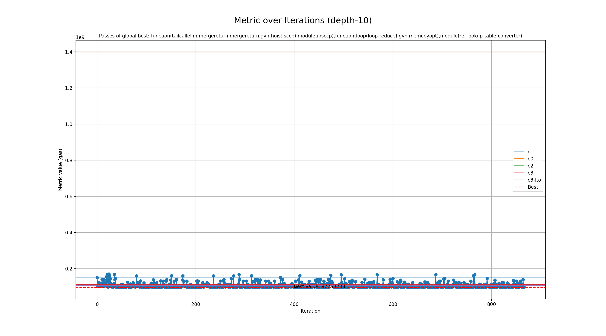

# Genetic run for metric gas

## Programs

- rsp

## zkVMs

- sp1

## Best profile

- Best profile: Profile(profile_name='genetic', rustflags='-C opt-level=2 -C lto=fat -C embed-bitcode -C codegen-units=1 -Cllvm-args=-available-load-scan-limit=5 -Cllvm-args=-early-ifcvt-limit=37 -Cllvm-args=-jump-threading-implication-search-threshold=8 -Cllvm-args=-jump-threading-threshold=20 -Cllvm-args=-licm-max-num-uses-traversed=11 -Cllvm-args=-loop-distribute-scev-check-threshold=60 -Cllvm-args=-max-dependences=34 -Cllvm-args=-max-nested-scalar-reduction-interleave=6 -Cllvm-args=-max-num-inline-blocks=4 -Cllvm-args=-max-speculation-depth=18 -Cllvm-args=-max-uses-for-sinking=87 -Cllvm-args=-memdep-block-number-limit=1234 -Cllvm-args=-memdep-block-scan-limit=27', cflags='-O2 -mllvm -available-load-scan-limit=5 -mllvm -early-ifcvt-limit=37 -mllvm -jump-threading-implication-search-threshold=8 -mllvm -jump-threading-threshold=20 -mllvm -licm-max-num-uses-traversed=11 -mllvm -loop-distribute-scev-check-threshold=60 -mllvm -max-dependences=34 -mllvm -max-nested-scalar-reduction-interleave=6 -mllvm -max-num-inline-blocks=4 -mllvm -max-speculation-depth=18 -mllvm -max-uses-for-sinking=87 -mllvm -memdep-block-number-limit=1234 -mllvm -memdep-block-scan-limit=27', passes=['function(tailcallelim,mergereturn,mergereturn,gvn-hoist,sccp),module(ipsccp),function(loop(loop-reduce),gvn,memcpyopt),module(rel-lookup-table-converter)'], prepopulate_passes=True, lower_atomic_before=False)
- Metric: 97253238
- Mode: depth-10
- Tune config: Profile(profile_name='genetic', rustflags='-C opt-level=2 -C lto=fat -C embed-bitcode -C codegen-units=1 -Cllvm-args=-available-load-scan-limit=5 -Cllvm-args=-early-ifcvt-limit=37 -Cllvm-args=-jump-threading-implication-search-threshold=8 -Cllvm-args=-jump-threading-threshold=20 -Cllvm-args=-licm-max-num-uses-traversed=11 -Cllvm-args=-loop-distribute-scev-check-threshold=60 -Cllvm-args=-max-dependences=34 -Cllvm-args=-max-nested-scalar-reduction-interleave=6 -Cllvm-args=-max-num-inline-blocks=4 -Cllvm-args=-max-speculation-depth=18 -Cllvm-args=-max-uses-for-sinking=87 -Cllvm-args=-memdep-block-number-limit=1234 -Cllvm-args=-memdep-block-scan-limit=27', cflags='-O2 -mllvm -available-load-scan-limit=5 -mllvm -early-ifcvt-limit=37 -mllvm -jump-threading-implication-search-threshold=8 -mllvm -jump-threading-threshold=20 -mllvm -licm-max-num-uses-traversed=11 -mllvm -loop-distribute-scev-check-threshold=60 -mllvm -max-dependences=34 -mllvm -max-nested-scalar-reduction-interleave=6 -mllvm -max-num-inline-blocks=4 -mllvm -max-speculation-depth=18 -mllvm -max-uses-for-sinking=87 -mllvm -memdep-block-number-limit=1234 -mllvm -memdep-block-scan-limit=27', passes=['function(tailcallelim,mergereturn,mergereturn,gvn-hoist,sccp),module(ipsccp),function(loop(loop-reduce),gvn,memcpyopt),module(rel-lookup-table-converter)'], prepopulate_passes=True, lower_atomic_before=False)

## Overview
  

## Baseline values

- o1: [MetricValue(zkvm='sp1', program='rsp', metric=149211123, timeout=False)]
- o0: [MetricValue(zkvm='sp1', program='rsp', metric=1398390950, timeout=False)]
- o2: [MetricValue(zkvm='sp1', program='rsp', metric=113628043, timeout=False)]
- o3: [MetricValue(zkvm='sp1', program='rsp', metric=112162332, timeout=False)]
- o3-lto: [MetricValue(zkvm='sp1', program='rsp', metric=105459166, timeout=False)]
