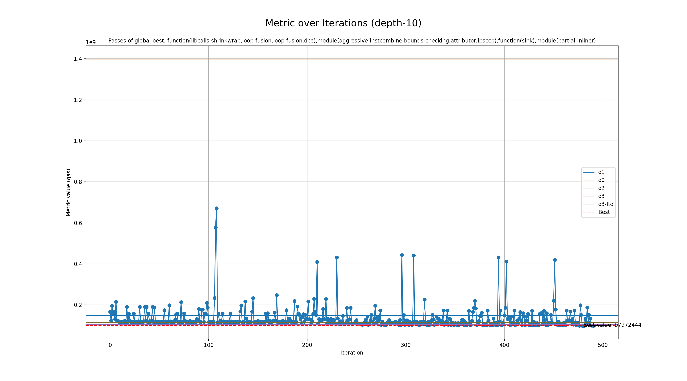

# Genetic run for metric gas

## Programs

- rsp

## zkVMs

- sp1

## Best profile

- Best profile: Profile(profile_name='genetic', rustflags='-C opt-level=2 -C lto=fat -C embed-bitcode -C codegen-units=1 -Cllvm-args=-available-load-scan-limit=8 -Cllvm-args=-bonus-inst-threshold=4 -Cllvm-args=-early-ifcvt-limit=46 -Cllvm-args=-inline-threshold=162 -Cllvm-args=-jump-threading-implication-search-threshold=8 -Cllvm-args=-jump-threading-threshold=12 -Cllvm-args=-licm-max-num-uses-traversed=15 -Cllvm-args=-licm-versioning-max-depth-threshold=3 -Cllvm-args=-loop-distribute-scev-check-threshold=16 -Cllvm-args=-loop-interchange-threshold=3 -Cllvm-args=-loop-load-elimination-scev-check-threshold=19 -Cllvm-args=-max-dependences=218 -Cllvm-args=-max-nested-scalar-reduction-interleave=4 -Cllvm-args=-max-num-inline-blocks=9 -Cllvm-args=-max-speculation-depth=19 -Cllvm-args=-max-uses-for-sinking=38 -Cllvm-args=-memdep-block-number-limit=636 -Cllvm-args=-memdep-block-scan-limit=206', cflags='-O2 -mllvm -available-load-scan-limit=8 -mllvm -bonus-inst-threshold=4 -mllvm -early-ifcvt-limit=46 -mllvm -inline-threshold=162 -mllvm -jump-threading-implication-search-threshold=8 -mllvm -jump-threading-threshold=12 -mllvm -licm-max-num-uses-traversed=15 -mllvm -licm-versioning-max-depth-threshold=3 -mllvm -loop-distribute-scev-check-threshold=16 -mllvm -loop-interchange-threshold=3 -mllvm -loop-load-elimination-scev-check-threshold=19 -mllvm -max-dependences=218 -mllvm -max-nested-scalar-reduction-interleave=4 -mllvm -max-num-inline-blocks=9 -mllvm -max-speculation-depth=19 -mllvm -max-uses-for-sinking=38 -mllvm -memdep-block-number-limit=636 -mllvm -memdep-block-scan-limit=206', passes=['function(libcalls-shrinkwrap,loop-fusion,loop-fusion,dce),module(aggressive-instcombine,bounds-checking,attributor,ipsccp),function(sink),module(partial-inliner)'], prepopulate_passes=True, lower_atomic_before=False)
- Metric: 97972444
- Mode: depth-10
- Tune config: Profile(profile_name='genetic', rustflags='-C opt-level=2 -C lto=fat -C embed-bitcode -C codegen-units=1 -Cllvm-args=-available-load-scan-limit=8 -Cllvm-args=-bonus-inst-threshold=4 -Cllvm-args=-early-ifcvt-limit=46 -Cllvm-args=-inline-threshold=162 -Cllvm-args=-jump-threading-implication-search-threshold=8 -Cllvm-args=-jump-threading-threshold=12 -Cllvm-args=-licm-max-num-uses-traversed=15 -Cllvm-args=-licm-versioning-max-depth-threshold=3 -Cllvm-args=-loop-distribute-scev-check-threshold=16 -Cllvm-args=-loop-interchange-threshold=3 -Cllvm-args=-loop-load-elimination-scev-check-threshold=19 -Cllvm-args=-max-dependences=218 -Cllvm-args=-max-nested-scalar-reduction-interleave=4 -Cllvm-args=-max-num-inline-blocks=9 -Cllvm-args=-max-speculation-depth=19 -Cllvm-args=-max-uses-for-sinking=38 -Cllvm-args=-memdep-block-number-limit=636 -Cllvm-args=-memdep-block-scan-limit=206', cflags='-O2 -mllvm -available-load-scan-limit=8 -mllvm -bonus-inst-threshold=4 -mllvm -early-ifcvt-limit=46 -mllvm -inline-threshold=162 -mllvm -jump-threading-implication-search-threshold=8 -mllvm -jump-threading-threshold=12 -mllvm -licm-max-num-uses-traversed=15 -mllvm -licm-versioning-max-depth-threshold=3 -mllvm -loop-distribute-scev-check-threshold=16 -mllvm -loop-interchange-threshold=3 -mllvm -loop-load-elimination-scev-check-threshold=19 -mllvm -max-dependences=218 -mllvm -max-nested-scalar-reduction-interleave=4 -mllvm -max-num-inline-blocks=9 -mllvm -max-speculation-depth=19 -mllvm -max-uses-for-sinking=38 -mllvm -memdep-block-number-limit=636 -mllvm -memdep-block-scan-limit=206', passes=['function(libcalls-shrinkwrap,loop-fusion,loop-fusion,dce),module(aggressive-instcombine,bounds-checking,attributor,ipsccp),function(sink),module(partial-inliner)'], prepopulate_passes=True, lower_atomic_before=False)

## Overview
  

## Baseline values

- o1: [MetricValue(zkvm='sp1', program='rsp', metric=149211123, timeout=False)]
- o0: [MetricValue(zkvm='sp1', program='rsp', metric=1398390950, timeout=False)]
- o2: [MetricValue(zkvm='sp1', program='rsp', metric=113628043, timeout=False)]
- o3: [MetricValue(zkvm='sp1', program='rsp', metric=112162332, timeout=False)]
- o3-lto: [MetricValue(zkvm='sp1', program='rsp', metric=105459166, timeout=False)]
