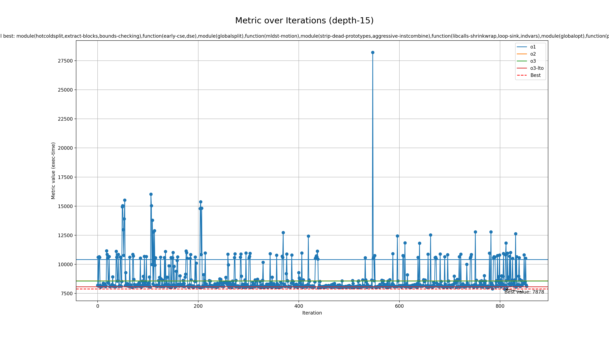

# Genetic run for metric exec-time

## Programs

- rsp

## zkVMs

- sp1

## Best profile

- Best profile: Profile(profile_name='genetic', rustflags='-C opt-level=3 -C lto=fat -C embed-bitcode -C codegen-units=1 -Cllvm-args=-bonus-inst-threshold=6 -Cllvm-args=-inline-threshold=269 -Cllvm-args=-licm-max-num-uses-traversed=24 -Cllvm-args=-licm-versioning-max-depth-threshold=1 -Cllvm-args=-loop-distribute-scev-check-threshold=0 -Cllvm-args=-loop-load-elimination-scev-check-threshold=3 -Cllvm-args=-max-nested-scalar-reduction-interleave=4 -Cllvm-args=-max-num-inline-blocks=7 -Cllvm-args=-max-speculation-depth=10 -Cllvm-args=-max-uses-for-sinking=20 -Cllvm-args=-memdep-block-scan-limit=182', cflags='-O3 -mllvm -bonus-inst-threshold=6 -mllvm -inline-threshold=269 -mllvm -licm-max-num-uses-traversed=24 -mllvm -licm-versioning-max-depth-threshold=1 -mllvm -loop-distribute-scev-check-threshold=0 -mllvm -loop-load-elimination-scev-check-threshold=3 -mllvm -max-nested-scalar-reduction-interleave=4 -mllvm -max-num-inline-blocks=7 -mllvm -max-speculation-depth=10 -mllvm -max-uses-for-sinking=20 -mllvm -memdep-block-scan-limit=182', passes=['module(hotcoldsplit,extract-blocks,bounds-checking),function(early-cse,dse),module(globalsplit),function(mldst-motion),module(strip-dead-prototypes,aggressive-instcombine),function(libcalls-shrinkwrap,loop-sink,indvars),module(globalopt),function(partially-inline-libcalls)'], prepopulate_passes=True, lower_atomic_before=False)
- Metric: 7878
- Mode: depth-15
- Tune config: Profile(profile_name='genetic', rustflags='-C opt-level=3 -C lto=fat -C embed-bitcode -C codegen-units=1 -Cllvm-args=-bonus-inst-threshold=6 -Cllvm-args=-inline-threshold=269 -Cllvm-args=-licm-max-num-uses-traversed=24 -Cllvm-args=-licm-versioning-max-depth-threshold=1 -Cllvm-args=-loop-distribute-scev-check-threshold=0 -Cllvm-args=-loop-load-elimination-scev-check-threshold=3 -Cllvm-args=-max-nested-scalar-reduction-interleave=4 -Cllvm-args=-max-num-inline-blocks=7 -Cllvm-args=-max-speculation-depth=10 -Cllvm-args=-max-uses-for-sinking=20 -Cllvm-args=-memdep-block-scan-limit=182', cflags='-O3 -mllvm -bonus-inst-threshold=6 -mllvm -inline-threshold=269 -mllvm -licm-max-num-uses-traversed=24 -mllvm -licm-versioning-max-depth-threshold=1 -mllvm -loop-distribute-scev-check-threshold=0 -mllvm -loop-load-elimination-scev-check-threshold=3 -mllvm -max-nested-scalar-reduction-interleave=4 -mllvm -max-num-inline-blocks=7 -mllvm -max-speculation-depth=10 -mllvm -max-uses-for-sinking=20 -mllvm -memdep-block-scan-limit=182', passes=['module(hotcoldsplit,extract-blocks,bounds-checking),function(early-cse,dse),module(globalsplit),function(mldst-motion),module(strip-dead-prototypes,aggressive-instcombine),function(libcalls-shrinkwrap,loop-sink,indvars),module(globalopt),function(partially-inline-libcalls)'], prepopulate_passes=True, lower_atomic_before=False)

## Overview
  

## Baseline values

- o1: [MetricValue(zkvm='sp1', program='rsp', metric=10412, timeout=False)]
- o2: [MetricValue(zkvm='sp1', program='rsp', metric=8577, timeout=False)]
- o3: [MetricValue(zkvm='sp1', program='rsp', metric=8558, timeout=False)]
- o3-lto: [MetricValue(zkvm='sp1', program='rsp', metric=8063, timeout=False)]
