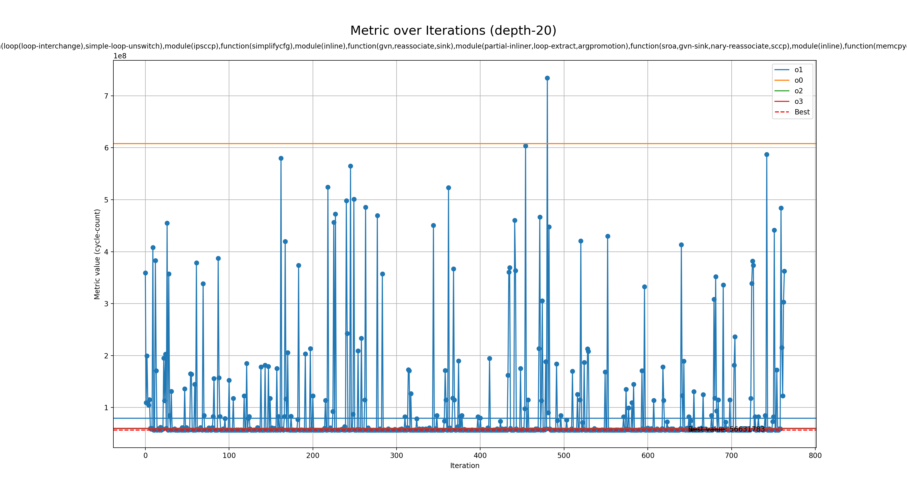

# Genetic run for metric cycle-count

## Programs

- rsp

## zkVMs

- sp1

## Best profile

- Best profile: ProfileConfig(name='genetic', lto='fat', single_codegen_unit=True, opt_level='3', prepopulate_passes=True, passes=['function(loop(loop-interchange),simple-loop-unswitch),module(ipsccp),function(simplifycfg),module(inline),function(gvn,reassociate,sink),module(partial-inliner,loop-extract,argpromotion),function(sroa,gvn-sink,nary-reassociate,sccp),module(inline),function(memcpyopt,gvn-hoist,memcpyopt,mem2reg)'])
- Metric: 56631783
- Mode: depth-20
- Tune config: ProfileConfig(name='genetic', lto='fat', single_codegen_unit=True, opt_level='3', prepopulate_passes=True, passes=['function(loop(loop-interchange),simple-loop-unswitch),module(ipsccp),function(simplifycfg),module(inline),function(gvn,reassociate,sink),module(partial-inliner,loop-extract,argpromotion),function(sroa,gvn-sink,nary-reassociate,sccp),module(inline),function(memcpyopt,gvn-hoist,memcpyopt,mem2reg)'])

## Overview
  

## Baseline values

- o1: [MetricValue(zkvm='sp1', program='rsp', metric=79297811, timeout=False)]
- o0: [MetricValue(zkvm='sp1', program='rsp', metric=607823116, timeout=False)]
- o2: [MetricValue(zkvm='sp1', program='rsp', metric=60214056, timeout=False)]
- o3: [MetricValue(zkvm='sp1', program='rsp', metric=59700827, timeout=False)]
