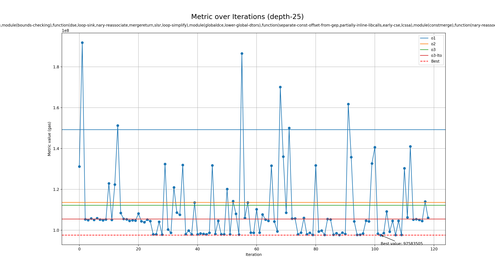

# Genetic run for metric gas

## Programs

- rsp

## zkVMs

- sp1

## Best profile

- Best profile: Profile(profile_name='genetic', rustflags='-C opt-level=2 -C lto=fat -C embed-bitcode -C codegen-units=1 -Cllvm-args=-jump-threading-implication-search-threshold=8 -Cllvm-args=-licm-max-num-uses-traversed=24 -Cllvm-args=-licm-versioning-max-depth-threshold=4 -Cllvm-args=-loop-distribute-scev-check-threshold=44 -Cllvm-args=-loop-interchange-threshold=2 -Cllvm-args=-loop-load-elimination-scev-check-threshold=3 -Cllvm-args=-max-nested-scalar-reduction-interleave=1 -Cllvm-args=-max-num-inline-blocks=12 -Cllvm-args=-max-speculation-depth=2 -Cllvm-args=-max-uses-for-sinking=61 -Cllvm-args=-memdep-block-scan-limit=142', cflags='-O2 -mllvm -jump-threading-implication-search-threshold=8 -mllvm -licm-max-num-uses-traversed=24 -mllvm -licm-versioning-max-depth-threshold=4 -mllvm -loop-distribute-scev-check-threshold=44 -mllvm -loop-interchange-threshold=2 -mllvm -loop-load-elimination-scev-check-threshold=3 -mllvm -max-nested-scalar-reduction-interleave=1 -mllvm -max-num-inline-blocks=12 -mllvm -max-speculation-depth=2 -mllvm -max-uses-for-sinking=61 -mllvm -memdep-block-scan-limit=142', passes=['module(strip-dead-debug-info),function(guard-widening,gvn-sink,instsimplify),module(bounds-checking),function(dse,loop-sink,nary-reassociate,mergereturn,slsr,loop-simplify),module(globaldce,lower-global-dtors),function(separate-const-offset-from-gep,partially-inline-libcalls,early-cse,lcssa),module(constmerge),function(nary-reassociate,loop(loop-reduce)),module(ipsccp),function(consthoist,newgvn,loop(loop-reduce)),module(globaldce)'], prepopulate_passes=True, lower_atomic_before=False)
- Metric: 97583505
- Mode: depth-25
- Tune config: Profile(profile_name='genetic', rustflags='-C opt-level=2 -C lto=fat -C embed-bitcode -C codegen-units=1 -Cllvm-args=-jump-threading-implication-search-threshold=8 -Cllvm-args=-licm-max-num-uses-traversed=24 -Cllvm-args=-licm-versioning-max-depth-threshold=4 -Cllvm-args=-loop-distribute-scev-check-threshold=44 -Cllvm-args=-loop-interchange-threshold=2 -Cllvm-args=-loop-load-elimination-scev-check-threshold=3 -Cllvm-args=-max-nested-scalar-reduction-interleave=1 -Cllvm-args=-max-num-inline-blocks=12 -Cllvm-args=-max-speculation-depth=2 -Cllvm-args=-max-uses-for-sinking=61 -Cllvm-args=-memdep-block-scan-limit=142', cflags='-O2 -mllvm -jump-threading-implication-search-threshold=8 -mllvm -licm-max-num-uses-traversed=24 -mllvm -licm-versioning-max-depth-threshold=4 -mllvm -loop-distribute-scev-check-threshold=44 -mllvm -loop-interchange-threshold=2 -mllvm -loop-load-elimination-scev-check-threshold=3 -mllvm -max-nested-scalar-reduction-interleave=1 -mllvm -max-num-inline-blocks=12 -mllvm -max-speculation-depth=2 -mllvm -max-uses-for-sinking=61 -mllvm -memdep-block-scan-limit=142', passes=['module(strip-dead-debug-info),function(guard-widening,gvn-sink,instsimplify),module(bounds-checking),function(dse,loop-sink,nary-reassociate,mergereturn,slsr,loop-simplify),module(globaldce,lower-global-dtors),function(separate-const-offset-from-gep,partially-inline-libcalls,early-cse,lcssa),module(constmerge),function(nary-reassociate,loop(loop-reduce)),module(ipsccp),function(consthoist,newgvn,loop(loop-reduce)),module(globaldce)'], prepopulate_passes=True, lower_atomic_before=False)

## Overview
  

## Baseline values

- o1: [MetricValue(zkvm='sp1', program='rsp', metric=149211123, timeout=False)]
- o2: [MetricValue(zkvm='sp1', program='rsp', metric=113628043, timeout=False)]
- o3: [MetricValue(zkvm='sp1', program='rsp', metric=112162332, timeout=False)]
- o3-lto: [MetricValue(zkvm='sp1', program='rsp', metric=105459166, timeout=False)]
