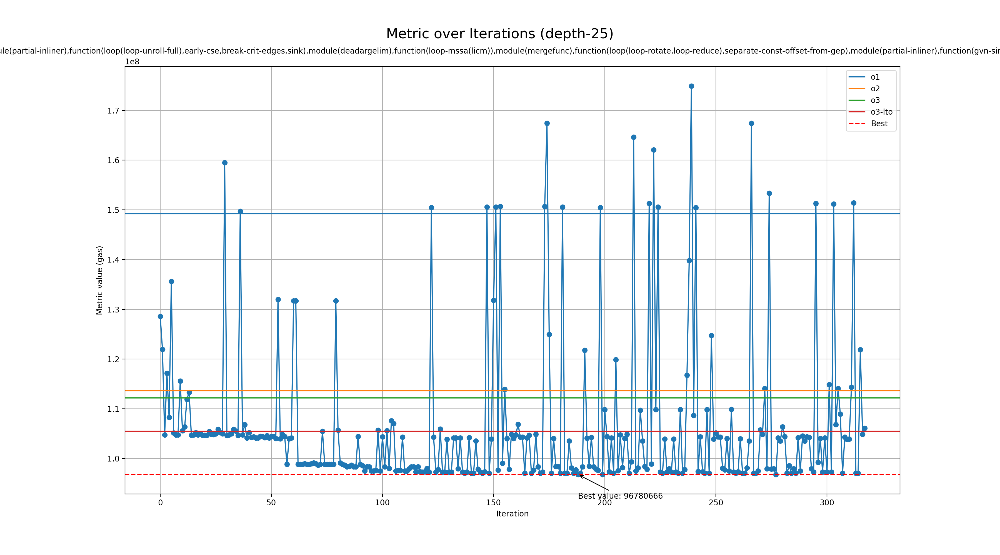

# Genetic run for metric gas

## Programs

- rsp

## zkVMs

- sp1

## Best profile

- Best profile: Profile(profile_name='genetic', rustflags='-C opt-level=2 -C lto=fat -C embed-bitcode -C codegen-units=1 -Cllvm-args=-available-load-scan-limit=15 -Cllvm-args=-early-ifcvt-limit=17 -Cllvm-args=-loop-distribute-scev-check-threshold=100 -Cllvm-args=-max-dependences=360 -Cllvm-args=-max-nested-scalar-reduction-interleave=2 -Cllvm-args=-max-num-inline-blocks=4 -Cllvm-args=-memdep-block-number-limit=2849 -Cllvm-args=-memdep-block-scan-limit=87', cflags='-O2 -mllvm -available-load-scan-limit=15 -mllvm -early-ifcvt-limit=17 -mllvm -loop-distribute-scev-check-threshold=100 -mllvm -max-dependences=360 -mllvm -max-nested-scalar-reduction-interleave=2 -mllvm -max-num-inline-blocks=4 -mllvm -memdep-block-number-limit=2849 -mllvm -memdep-block-scan-limit=87', passes=['function(consthoist,guard-widening,slsr,lcssa,newgvn,speculative-execution),module(partial-inliner),function(loop(loop-unroll-full),early-cse,break-crit-edges,sink),module(deadargelim),function(loop-mssa(licm)),module(mergefunc),function(loop(loop-rotate,loop-reduce),separate-const-offset-from-gep),module(partial-inliner),function(gvn-sink,loop-data-prefetch,loop(loop-idiom)),module(extract-blocks),function(consthoist,lcssa,loop(loop-predication))'], prepopulate_passes=True, lower_atomic_before=False)
- Metric: 96780666
- Mode: depth-25
- Tune config: Profile(profile_name='genetic', rustflags='-C opt-level=2 -C lto=fat -C embed-bitcode -C codegen-units=1 -Cllvm-args=-available-load-scan-limit=15 -Cllvm-args=-early-ifcvt-limit=17 -Cllvm-args=-loop-distribute-scev-check-threshold=100 -Cllvm-args=-max-dependences=360 -Cllvm-args=-max-nested-scalar-reduction-interleave=2 -Cllvm-args=-max-num-inline-blocks=4 -Cllvm-args=-memdep-block-number-limit=2849 -Cllvm-args=-memdep-block-scan-limit=87', cflags='-O2 -mllvm -available-load-scan-limit=15 -mllvm -early-ifcvt-limit=17 -mllvm -loop-distribute-scev-check-threshold=100 -mllvm -max-dependences=360 -mllvm -max-nested-scalar-reduction-interleave=2 -mllvm -max-num-inline-blocks=4 -mllvm -memdep-block-number-limit=2849 -mllvm -memdep-block-scan-limit=87', passes=['function(consthoist,guard-widening,slsr,lcssa,newgvn,speculative-execution),module(partial-inliner),function(loop(loop-unroll-full),early-cse,break-crit-edges,sink),module(deadargelim),function(loop-mssa(licm)),module(mergefunc),function(loop(loop-rotate,loop-reduce),separate-const-offset-from-gep),module(partial-inliner),function(gvn-sink,loop-data-prefetch,loop(loop-idiom)),module(extract-blocks),function(consthoist,lcssa,loop(loop-predication))'], prepopulate_passes=True, lower_atomic_before=False)

## Overview
  

## Baseline values

- o1: [MetricValue(zkvm='sp1', program='rsp', metric=149211123, timeout=False)]
- o2: [MetricValue(zkvm='sp1', program='rsp', metric=113628043, timeout=False)]
- o3: [MetricValue(zkvm='sp1', program='rsp', metric=112162332, timeout=False)]
- o3-lto: [MetricValue(zkvm='sp1', program='rsp', metric=105459166, timeout=False)]
