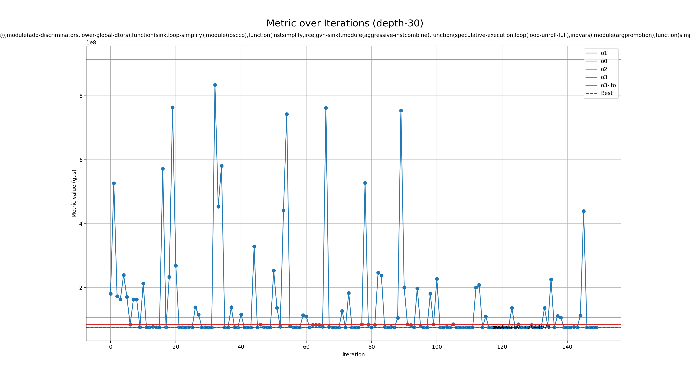

# Genetic run for metric gas

## Programs

- rsp

## zkVMs

- sp1

## Best profile

- Best profile: ProfileConfig(name='genetic', lto='fat', single_codegen_unit=False, opt_level='3', prepopulate_passes=True, passes=['function(reassociate),module(function-attrs,wholeprogramdevirt),function(speculative-execution,simple-loop-unswitch,loop(loop-rotate)),module(add-discriminators,lower-global-dtors),function(sink,loop-simplify),module(ipsccp),function(instsimplify,irce,gvn-sink),module(aggressive-instcombine),function(speculative-execution,loop(loop-unroll-full),indvars),module(argpromotion),function(simple-loop-unswitch,jump-threading,gvn-hoist,float2int),module(inline),function(loop-simplify,mergeicmps),module(deadargelim),function(indvars,newgvn,consthoist)'])
- Metric: 75644973
- Mode: depth-30
- Tune config: ProfileConfig(name='genetic', lto='fat', single_codegen_unit=False, opt_level='3', prepopulate_passes=True, passes=['function(reassociate),module(function-attrs,wholeprogramdevirt),function(speculative-execution,simple-loop-unswitch,loop(loop-rotate)),module(add-discriminators,lower-global-dtors),function(sink,loop-simplify),module(ipsccp),function(instsimplify,irce,gvn-sink),module(aggressive-instcombine),function(speculative-execution,loop(loop-unroll-full),indvars),module(argpromotion),function(simple-loop-unswitch,jump-threading,gvn-hoist,float2int),module(inline),function(loop-simplify,mergeicmps),module(deadargelim),function(indvars,newgvn,consthoist)'])

## Overview
  

## Baseline values

- o1: [MetricValue(zkvm='sp1', program='rsp', metric=108000618, timeout=False)]
- o0: [MetricValue(zkvm='sp1', program='rsp', metric=913731512, timeout=False)]
- o2: [MetricValue(zkvm='sp1', program='rsp', metric=85893243, timeout=False)]
- o3: [MetricValue(zkvm='sp1', program='rsp', metric=85412455, timeout=False)]
- o3-lto: [MetricValue(zkvm='sp1', program='rsp', metric=75949644, timeout=False)]
