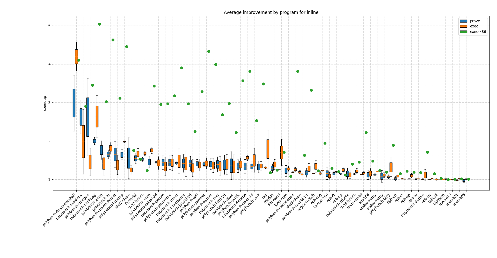
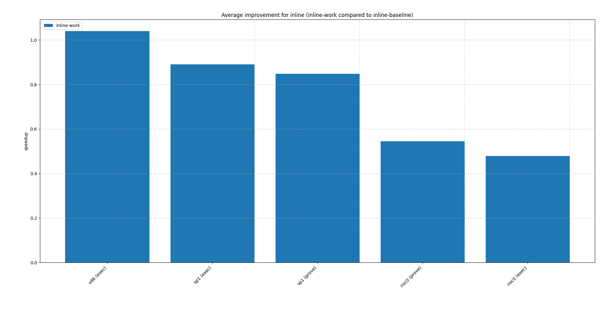
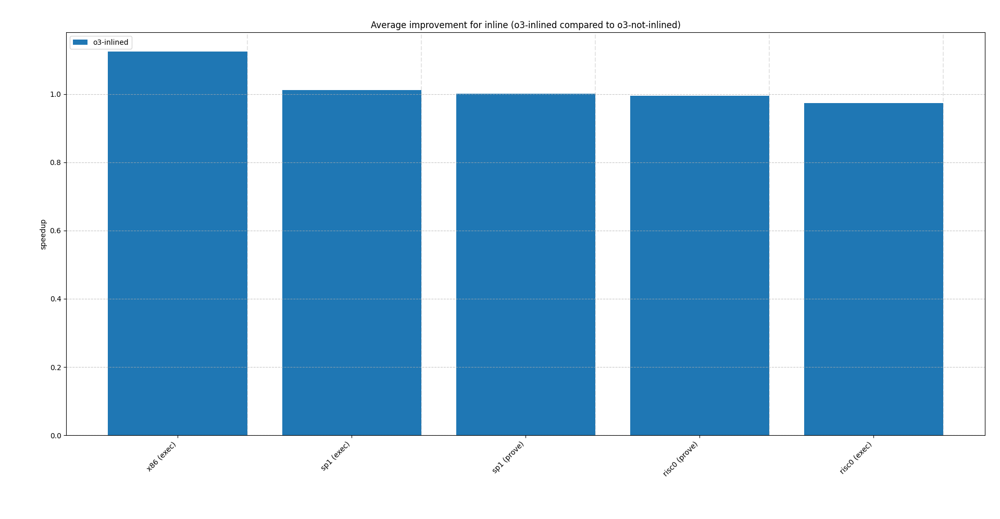

# inline

For some programs we see big improvements from inlining, in particular also when using an appropriatly tuned inlining threshold, see [npb](./npb.md).

In general however the programs affected by inlining on zkVMs and on standard x86 coincide, as shown below:



## Inlining negatively affecting performance

We test the following example (simplified) on both zkVMs and x86, once with inlining applied and once without inlining:

```rust
pub fn work(x: u64) -> u64 {
    let mut sum = x;
    for i in 0..100 {
        sum = sum.wrapping_mul(31).wrapping_add(i);
    }
    sum
}

fn main() {
    let n = 1000;
    for i in 0..n {
        let res = work(i as u64);
        core::hint::black_box(res);
    }
}
```

Inlining the function results in the following speedups (compared to the non-inlined versions):



For risc0 in particular we see a large drop in performance. Running the ELF and looking at the session's segments also shows that for risc0 the number of segments increased from 6 to 11, with an increase in cycles from 5618631 (226754 of which are paging cycles) to 11127631 (349164 of which are paging cycles).

Applying `o3` (and comparing the inlined vs. non-inlined case) yields much closer results:



Analyzing cycle counts on risc0 shows that the inlined version is performing about 2x the number of `sw` and `lw` instructions.

In the non-inlined version each outer‐loop iteration executes only a `jalr`/`ret` pair and saves/restores `ra`. Saving these 4 instructions for inlining is in this case negligible. If we however inline `work` into `main`, the compiler now has to keep three live 64-bit values at once (outer `i`, inner `i`, `sum`). LLVM therefore spills both the 64-bit loop counter and the running sum to the stack every inner-loop iteration. That doubles the lw/sw count, which alone accounts for most of the 2x jump in cycles. This also explains why `o3` narrows the gap, as the spilling onto the stack can be eliminated.

## Conclusions

- Branching/call overhead is much lower on zkVMs. A jump always takes one cycle and there is also no instruction cache that needs to be considered.
- Inlining should be avoided if it causes spilling to the stack. If the execution trace grows due to spilling inlining will likely hurt performance on zkVMs.
- Most operations on risc0 take either 1 or 2 cycles. Because of this 1:1 (or 2:1) mapping of instructions to cycles, even small differences in the generated instruction sequence can change cycle counts significantly.
- If inlining causes the stack to grow across page boundaries, loads and stores might be even more expensive due to page-ins and page-outs.
