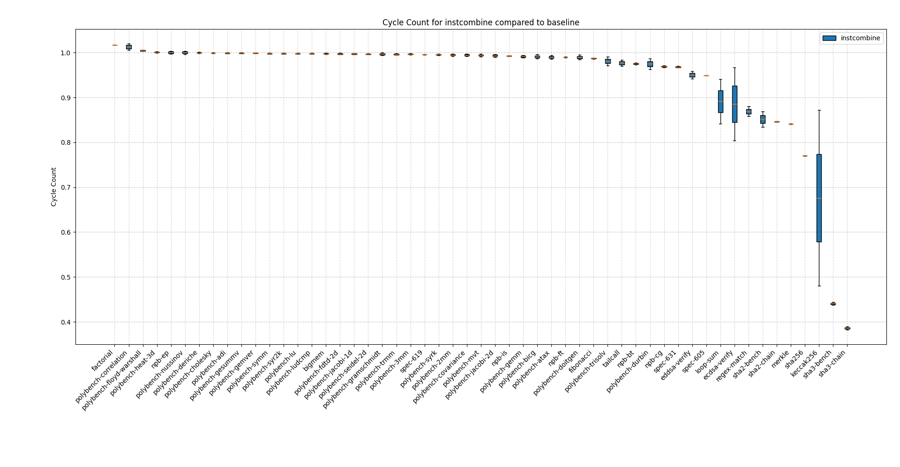

# instcombine

The instcombine pass is generally benefits zkVM execution as can e.g. be seen by the reduction in cycle count it causes:



However due to different instruction costs in zkVMs some of its transformations can be either not helpful or detrimental to performance. Replacing e.g. a `mul` by `slli` does not affect the cycle count on risc0 at all.

Consider the example `y = x * 3`. A common transformation might create the following (`(x<<1)+x`) from `mul  a0, a0, 3`:

```asm
slli t0, a0, 1
add  a0, a0, t0
```

On a zkVM that however tends to be 2x more expensive in general (as we double the cycle count).

## Conclusions

- The LLVM backend is responsible for undoing suboptimal instruction combinings that the instcombine pass made. The rv32im LLVM backend of the zkVMs should therefore consider their respective instruction costs here. This can be done by updating the `TargetTransformInfo` with the respective `InstructionCost`s.
- The uniform cost of most instructions should eb reflected in the LLVM backend.
