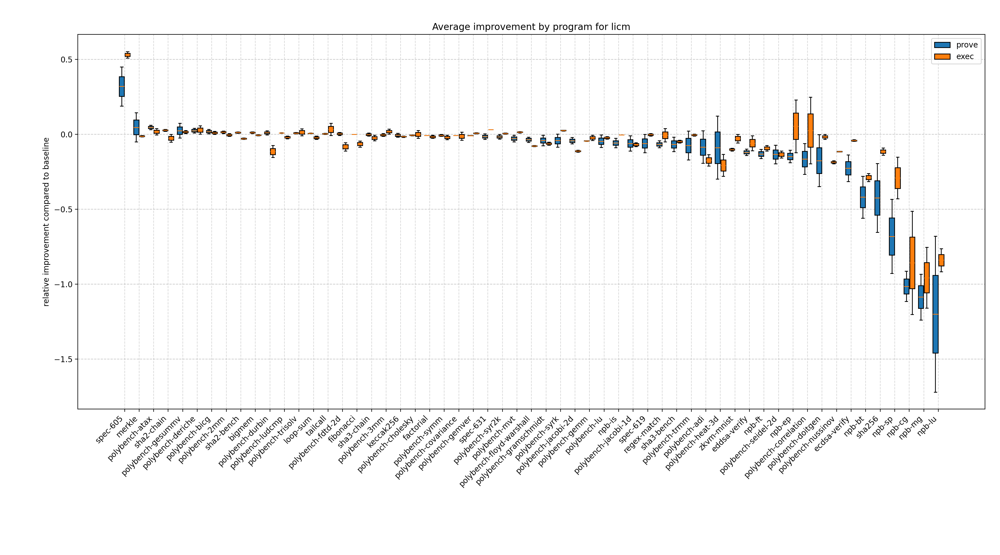
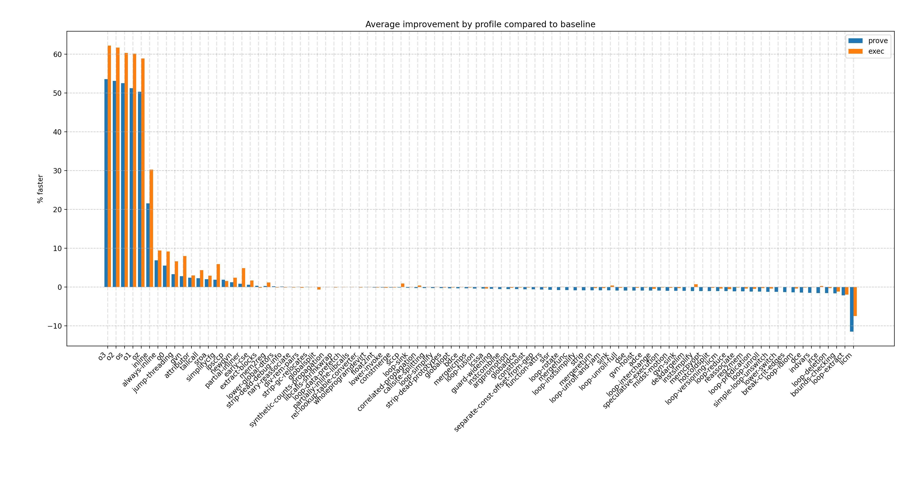
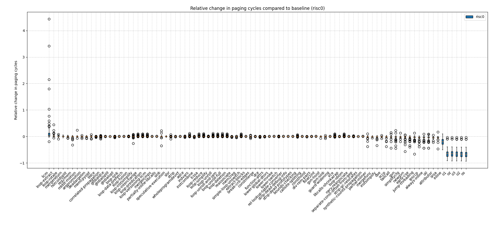

# licm

All programs in the `licm` profile are compiled with `opt-level=0` (`-O0` for C programs respectively, for rust programs we also set the `mir-opt-level` to `0`) with a single LLVM pass `loop-mssa(licm)`. As indicated in the figure below for all programs except `spec-605` `licm` either has negligible or negative effects.



Averaged across all programs `licm` performs more than 10% worse on proving and only slightly better in execution as seen in the figure below.



On average proving speed degraded the most for the `npb-lu` benchmark. For both zkVMs respectively we get the following estimates of the mean proving time across 10 samples for `npb-lu`:

- risc0: 271.30s for `licm` vs. 99.745s for `baseline`
- sp1: 86.042s for `licm` vs. 51.2s for `baseline`

For execution we get the following values:

- risc0: 2.0814s for `licm` vs. 1.2037s for `baseline`
- sp1: 1.4954s for `licm` vs. 881.97ms for `baseline`

For risc0 in particular we also detect a significant increase of paging cycles when applying `licm`. For `npb-lu` specifically the number of paging cycles on risc0 increases by 444% (from 7334356 to 39863296), while the number of user cycles only inceases by 69% (from 42068684 to 70658767). By the risc0 [Guest Optimization Guide](https://dev.risczero.com/api/zkvm/optimization#paging) a paging operation takes 1130 cycles on average, which suggests `licm` is causing around 28800 more paging cycles on `npb-lu` on risc0.

The below figure also shows the relative change in paging cylces (on risc0 only) across all benchmarked profiles:



Of all profiles we benchmarked, `licm` affects paging cycles by far the most, in almost all cases negatively.

The above suggests that degraded performance of `licm` compared to the `baseline` profile is caused by memory accesses that cause repeated page-ins and page-outs.

We profiled both risc0 and sp1 execution to determine various example functions where this performance degradation occurs. We next identified that even a single loop storing a value in an array already causes this regression on both zkVMs. The following LLVM IR diff illustrates this behavior:

```diff
diff --git a/results/root-cause-analysis-data/licm/loop-ll/baseline-single.txt b/results/root-cause-analysis-data/licm/loop-ll/licm-single.txt
index 11f3323..779e074 100644
--- a/results/root-cause-analysis-data/licm/loop-ll/baseline-single.txt
+++ b/results/root-cause-analysis-data/licm/loop-ll/licm-single.txt
@@ -1,30 +1,30 @@
 
   %1 = getelementptr inbounds i8, ptr %iter, i32 4
   store i32 %_2.1, ptr %1, align 4
+  %2 = getelementptr inbounds i8, ptr %_7, i32 4
+  %3 = getelementptr inbounds i8, ptr %_7, i32 4
   br label %bb2
 
 bb2:                                              ; preds = %bb7, %start
 ; call core::iter::range::<impl core::iter::traits::iterator::Iterator for core::ops::range::Range<A>>::next
-  %2 = call { i32, i32 } @"_ZN4core4iter5range101_$LT$impl$u20$core..iter..traits..iterator..Iterator$u20$for$u20$core..ops..range..Range$LT$A$GT$$GT$4next17hbf2518d2306d251fE"(ptr align 4 %iter) #4
-  %3 = extractvalue { i32, i32 } %2, 0
-  %4 = extractvalue { i32, i32 } %2, 1
-  store i32 %3, ptr %_7, align 4
-  %5 = getelementptr inbounds i8, ptr %_7, i32 4
-  store i32 %4, ptr %5, align 4
-  %_10 = load i32, ptr %_7, align 4
-  %6 = icmp eq i32 %_10, 0
-  br i1 %6, label %bb6, label %bb5
+  %4 = call { i32, i32 } @"_ZN4core4iter5range101_$LT$impl$u20$core..iter..traits..iterator..Iterator$u20$for$u20$core..ops..range..Range$LT$A$GT$$GT$4next17hbf2518d2306d251fE"(ptr align 4 %iter) #4
+  %5 = extractvalue { i32, i32 } %4, 0
+  %6 = extractvalue { i32, i32 } %4, 1
+  %7 = icmp eq i32 %5, 0
+  br i1 %7, label %bb6, label %bb5
 
 bb6:                                              ; preds = %bb2
+  %.lcssa2 = phi i32 [ %6, %bb2 ]
+  %.lcssa = phi i32 [ %5, %bb2 ]
+  store i32 %.lcssa, ptr %_7, align 4
+  store i32 %.lcssa2, ptr %2, align 4
   ret void
 
 bb5:                                              ; preds = %bb2
-  %7 = getelementptr inbounds i8, ptr %_7, i32 4
-  %k = load i32, ptr %7, align 4
-  %_15 = icmp ult i32 %k, 10000
+  %_15 = icmp ult i32 %6, 10000
   br i1 %_15, label %bb7, label %panic
 
 bb7:                                              ; preds = %bb5
-  %8 = getelementptr inbounds i32, ptr %v, i32 %k
+  %8 = getelementptr inbounds i32, ptr %v, i32 %6
   store i32 42, ptr %8, align 4
   br label %bb2
```

Increased loop nesting exacerbates this issue. We evaluated cycle counts across both zkVMs to measure the impact using the following example programs:

Depth 4:

```rust
fn main() {
    const N: usize = 10;
    let mut v = [[[[0; N]; N]; N]; N];
    for k in 0..N {
        for j in 0..N {
            for i in 0..N {
                for l in 0..N {
                    v[k][j][i][l] = 42;
                }
            }
        }
    }
}
```

Depth 2:

```rust
fn main() {
    const N: usize = 100;
    let mut v = [[0; N]; N];
    for k in 0..N {
        for j in 0..N {
            v[k][j] = 42;
        }
    }
}
```

Depth 1:

```rust
fn main() {
    const N: usize = 10000;
    let mut v = [0; N];
    for k in 0..N {
        v[k] = 42;
    }
}
```

Results:

| Nesting Depth | sp1 baseline | sp1 licm | degradation sp1 | risc0 baseline | risc0 licm | degradation risc0 |
| ------------- | ------------ | -------- | --------------- | -------------- | ---------- | ----------------- |
| 4             | 1340350      | 3377199  | 2.52x           | 1313861        | 3381200    | 2.57x             |
| 2             | 1061639      | 1324156  | 1.25x           | 1035640        | 1308623    | 1.26x             |
| 1             | 958550       | 999011   | 1.04x           | 941851         | 982766     | 1.04x             |

We have also observed this trend to continue for larger nesting depths. Further, the degradation in execution closely matches the degradation in cycle count in the above table.

This observation also aligns with our results in the `npb-lu` program as most functions that had strong performance regressions also exhibited multiple nested loops (up to depth four, see e.g. `rhs` in profiling info).

<!-- TODO:

- why licm degradation, npb-lu
  - compare llvm ir between baseline and licm for both risc0 and sp1
  - why does it not occur for polybench-lu?
- look at spec-605 sp1 (40% improvement licm)
- check whether combination with other optimizations is better -->
