# loop-unroll

Applying a single `loop-unroll` (or `loop-unroll-full` and `loop-unroll-and-jam` respectively) pass causes a regression in performance in nearly all programs on both zkVMs:

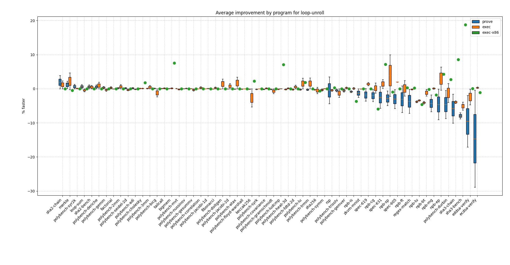

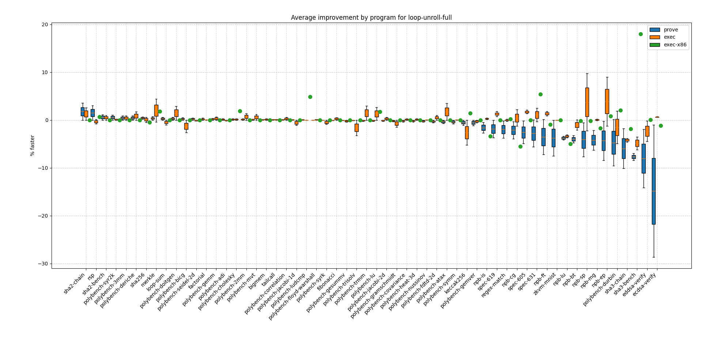

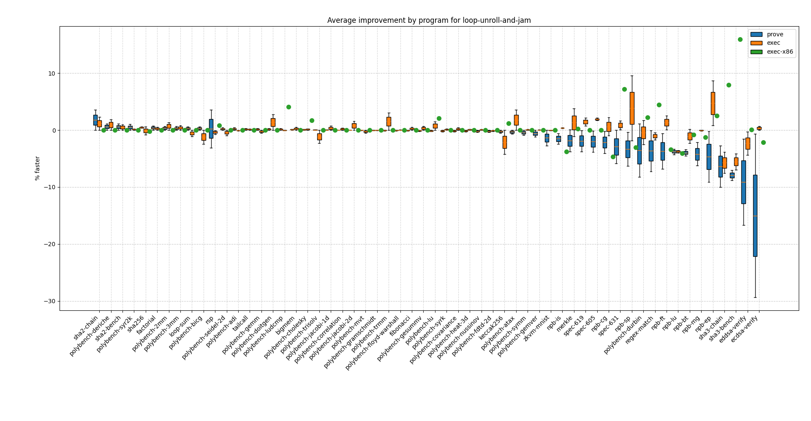

Looking at cycle count, we have a similar pattern:


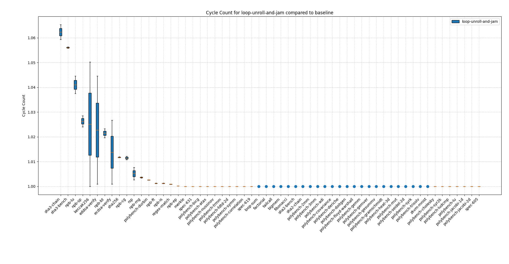

The above suggests that loop unrolling without any other optimizations is in general detrimental to zkVM execution and proving.

## Effect of applying single pass

We compile the following rust code for x86, risc0 and sp1 with the following configurations:

- completely unoptimized (baseline)
- baseline and `loop-unroll` applied
- baseline and `loop-unroll-full` applied
- baseline and `loop-unroll-and-jam` applied

```rust
pub fn matmul(mat: &[[f64; 5]; 5], vec: &[f64; 5]) -> [f64; 5] {
    let mut res = [0.0; 5];
    for col in 0..5 {
        for row in 0..5 {
            res[row] += mat[col][row] * vec[col];
        }
    }

    res
}
```

The following shows the average improvement/degradtion applying each of the respective loop unrolling passes yields on the given platform/measurement:

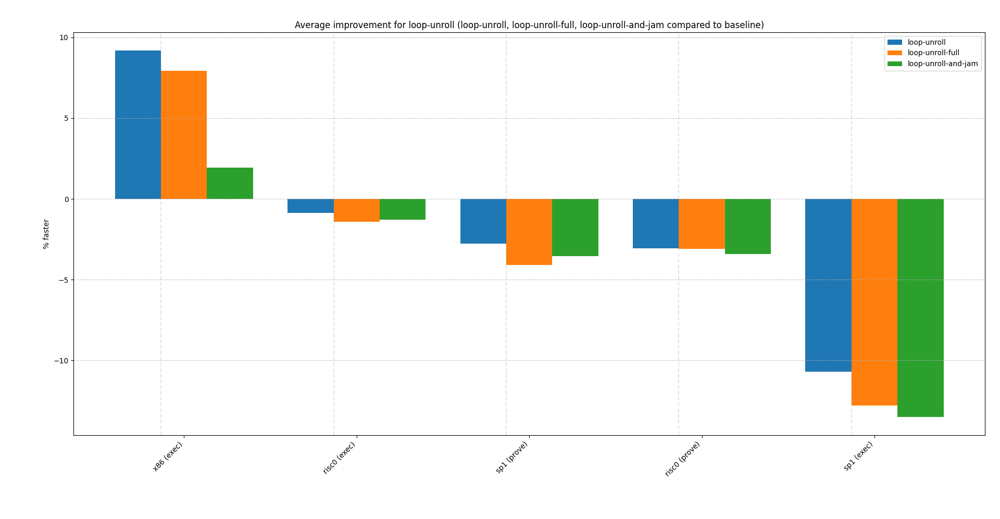

Measuring the speedup on the same data yields:

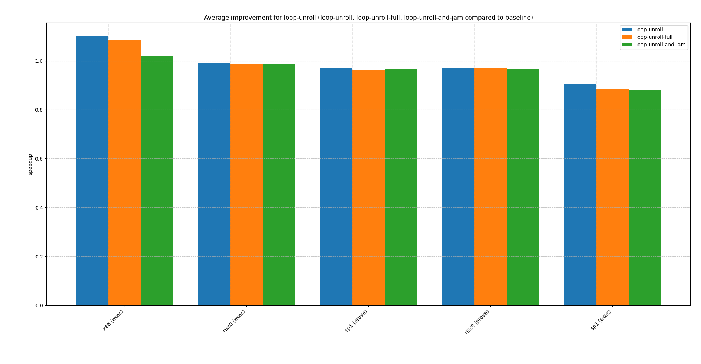

While both zkVMs are negatively affected by the single loop unrolling pass, sp1 seems to have consistently more degradation with loop unrolling compared to risc0.

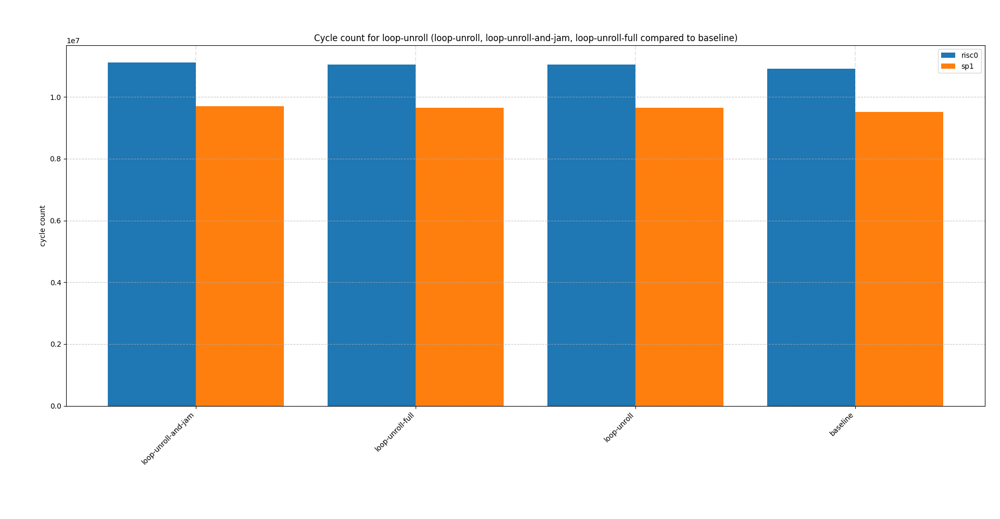

## Effect of o3 with and without loop unrolling

We now build the same program with `o3`, once with `-C llvm-args=-unroll-threshold=0` (denoted `loop-baseline`) and `-C llvm-args=-unroll-threshold=3000` (denoted `loop-unrolled`) to measure how loop unrolling affects zkVMs with other optimizations applied. We use the same `matmul` function as above.

For all zkVMs (both for proving and execution), we get an improvement in performance in the `loop-unrolled` configuration. This suggests that loop unrolling is still beneficial if used in conjunction with other optimizations. As before, the effect on risc0 is larger than sp1.

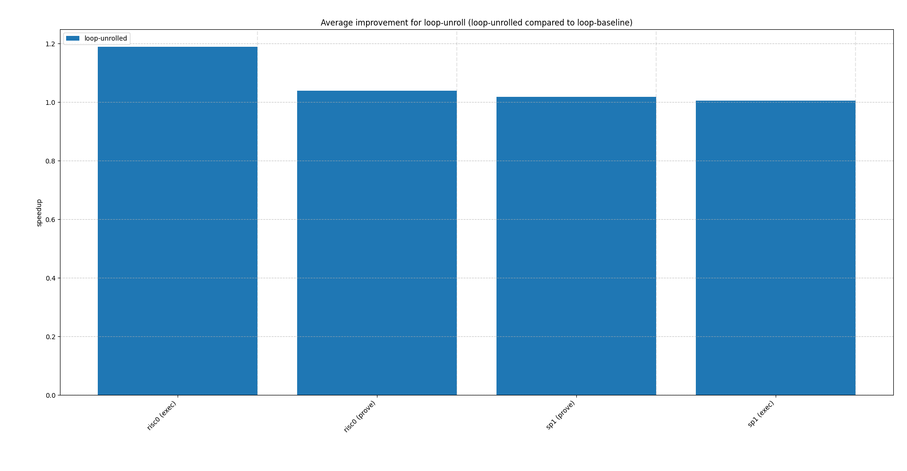

The cycle count measurements also support the above:

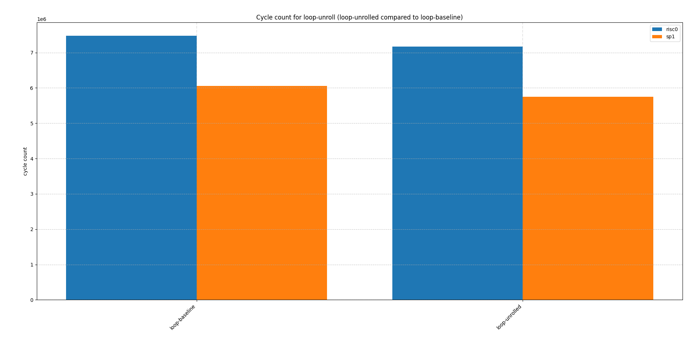

However, the improvements on both zkVMs are still dwarfed by the improvement we get on x86 (excluded above due to readability):

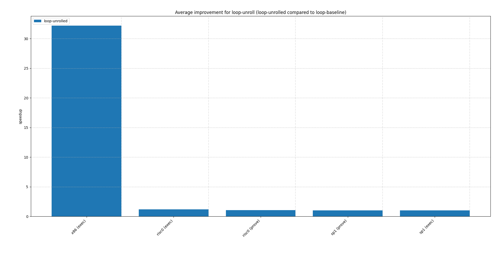

## Testing zkVM execution/proving via inline assembly

Next we measure zkVM execution and proving by manually unrolling the loop via inline assembly. This gives a better sense of how the optimization is applied.

For both zkVMs, we e.g. use the following `rv32im` assembly:

```rust
std::arch::asm!(
    "li   {sum}, 0",
    "li   {i},   0",
    "2:",
    "slli t0, {i}, 2",
    "add  t1, {array}, t0", // t1 has address of a[i]
    "lw   t0, 0(t1)",
    "add  {sum}, {sum}, t0",
    "addi {i}, {i}, 1",
    "blt  {i}, {limit}, 2b", // if i < 256, jump back to label 2
    array = in(reg) a.as_ptr(),
    sum   = out(reg) sum,
    i     = out(reg) _,
    limit = in(reg) 256,
    out("t0") _,
    out("t1") _,
    options(nostack)
);
```

With 4x loop unrolling applied:

```rust
std::arch::asm!(
    "li   {sum}, 0",
    "li   {i},   0",
    "2:",
    "slli t0, {i}, 2",
    "add  t1, {array}, t0", // t1 has address of a[i]
    "lw   t0, 0(t1)",
    "add  {sum}, {sum}, t0",
    "lw   t0, 4(t1)",
    "add  {sum}, {sum}, t0",
    "lw   t0, 8(t1)",
    "add  {sum}, {sum}, t0",
    "lw   t0, 12(t1)",
    "add  {sum}, {sum}, t0",
    "addi {i}, {i}, 4",
    "blt  {i}, {limit}, 2b", // if i < 256, jump back to label 2
    array = in(reg) a.as_ptr(),
    sum   = out(reg) sum,
    i     = out(reg) _,
    limit = in(reg) 256,
    out("t0") _,
    out("t1") _,
    options(nostack)
);
```

And similar for x86. See the respective [branch](https://github.com/thomasgassmann/thesis/tree/loop-unroll) for the detailed snippets. For all programs we now apply standard `o3` optimizations, still ensuring that the inline assembly is not optimized.

We evaluate both 4x (`loop-unrolled4`) and 16x (`loop-unrolled16`) loop unrolling.

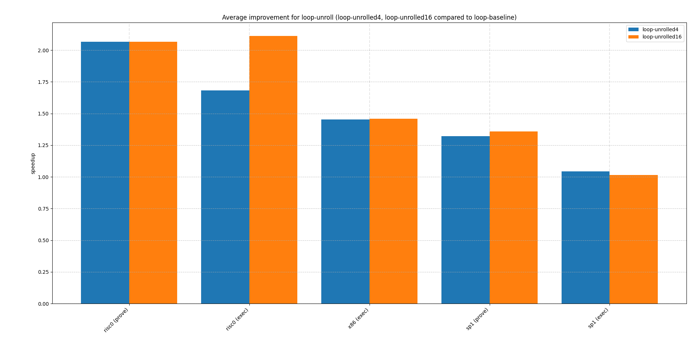

We again see a larger improvement on risc0 compared to sp1, with risc0 even managing to get a larger speedup than x86.

Looking at cycle count we can also see a clear reduction, mostly due to fewer loop control structures having to be executed.

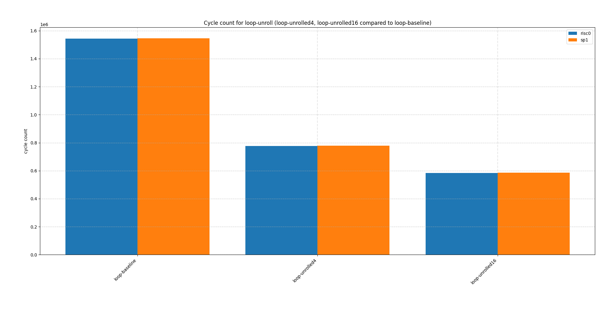

## Conclusions

While loop unrolling degrades performance on zkVMs on its own, in combination with other optimizations it can still be very beneficial. In general, performance improvements from loop unrolling is to be expected only whenever there is also a corresponding reduction in cycle count. This makes sense as zkVMs cannot take advantage of ILP, out-of-order execution of superscalar execution. Thus the benefits of loop unrolling to zkVMs lies only in the reduction of executed instructions, i.e. reduced loop control structure overhead.  

As the execution environment on zkVMs significantly differs from standard hardware, some of the heuristics in LLVM could also be adjusted for zkVM targets.
