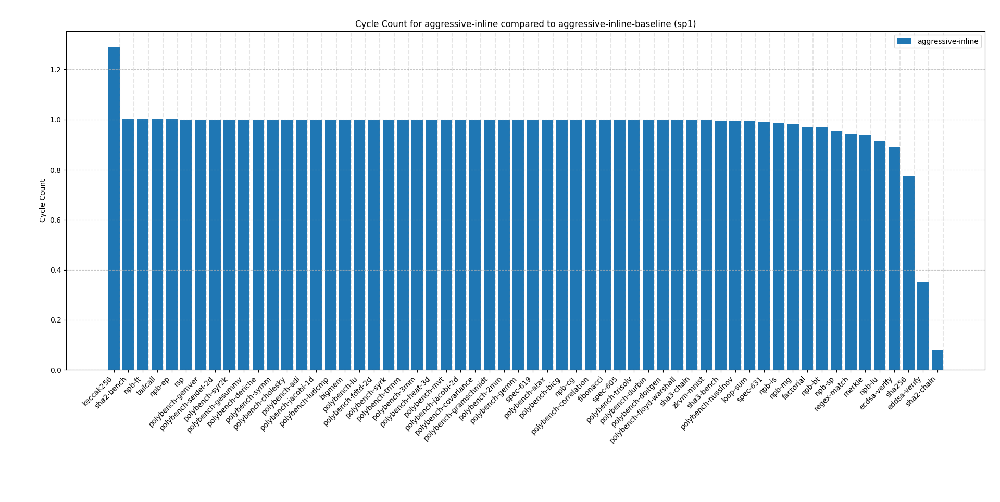
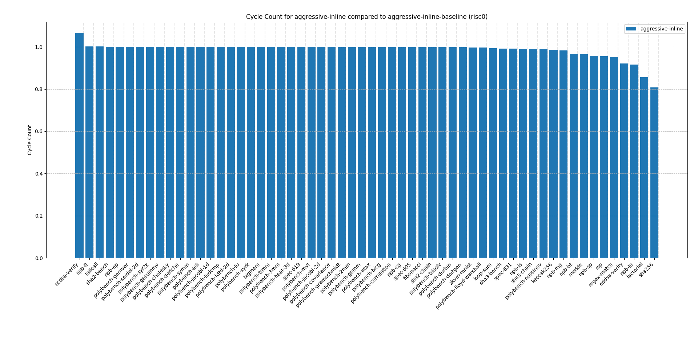

# npb genetic run

See also [npb report here](../../rq2/npb.md).

For the `npb` benchmark suite, applying the following passes:

```text
function(lower-invoke,simplifycfg),module(rel-lookup-table-converter),function(dse,reassociate,speculative-execution,separate-const-offset-from-gep),module(always-inline),function(irce),module(inline),function(gvn),module(function-attrs,attributor),function(loop-sink,loop-mssa(licm),dse,newgvn,loop(loop-reduce),reg2mem)
```

Along with the following flags:

```text
-C opt-level=3 -C lto=fat -C embed-bitcode -C codegen-units=1 -Cllvm-args=-inline-threshold=4328 -Cllvm-args=-jump-threading-implication-search-threshold=8 -Cllvm-args=-licm-versioning-max-depth-threshold=1 -Cllvm-args=-max-nested-scalar-reduction-interleave=2 -Cllvm-args=-max-speculation-depth=1 -Cllvm-args=-max-uses-for-sinking=47 -Cllvm-args=-memdep-block-number-limit=1121 -Cllvm-args=-memdep-block-scan-limit=276
```

results in the following speedup (compared to `o3-lto`):


Interestingly, when applying the same optimization sequence on standard x86 execution, we get a degradation in performance (also compared to `o3-lto`):


We next analyze `npb-bt` as it exhibits both behaviors strongly: it exhibits a strong speedup for both zkVMs and a strong degradation on x86.

First, all binaries prove and verify successfully (for both risc0 and sp1). By profiling we determine that e.g. the `initialize` function has 4x fewer samples in the above config as it does on `o3-lto`. Further, calls to `exact_solution` and `exact_solution_3d` are non-existent in our config, which suggests they were inlined.

Testing `npb-bt` with only the inlining optimizations (`-inline-threshold=4328` along with a single `module(inline)`) yields similar speedups:


Notice however that we don't have any degradation on x86 anymore.

We also tested the higher inlining threshold for all programs for execution (x86, risc0, sp1), which yields the following speedups:


While there are some cases where inlining greatly improves zkVM execution, on average the more aggressive inlining performs similarly (especially for sp1).

The more aggressive inlining yields the following speedups compared to standard `o3`:

- x86: 0.9918282680487865
- risc0: 1.0632835832085088 (slight improvement)
- sp1: 1.0088543710976539

For some programs it may thus be beneficial to tune the inlining threshold to achieve speedups in execution/proving.

## Increasing inline threshold

We also see this in terms of cycle count: below we applied an inline-threshold of 32766 to all programs and compared the number of reduced cycles compared to o3-lto:




