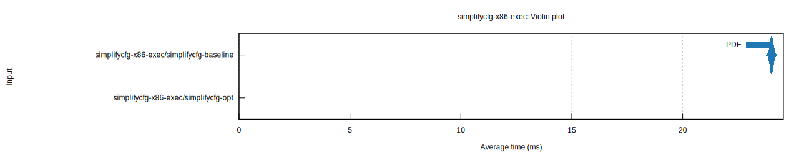
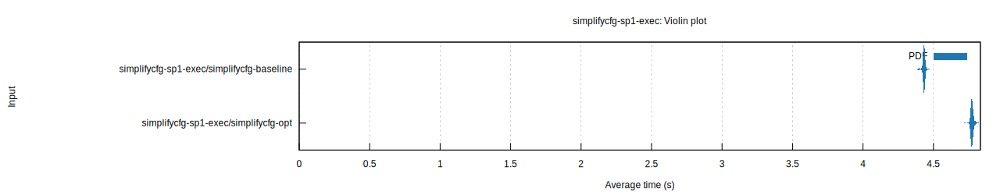
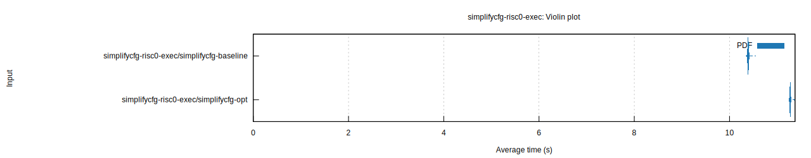
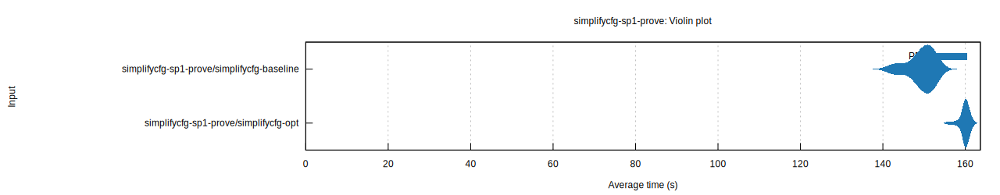
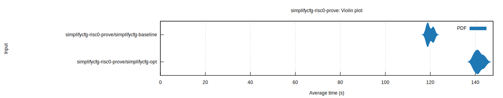
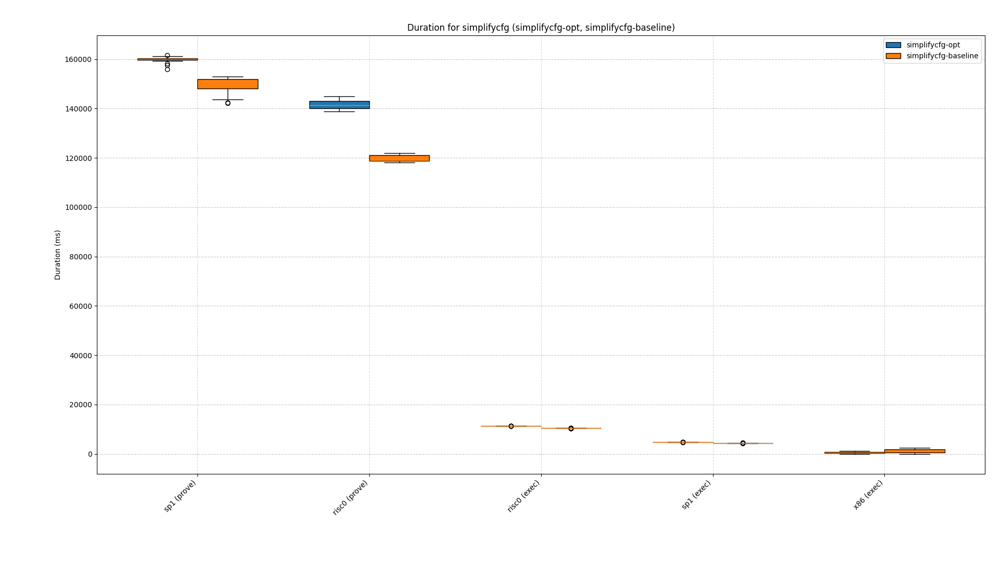
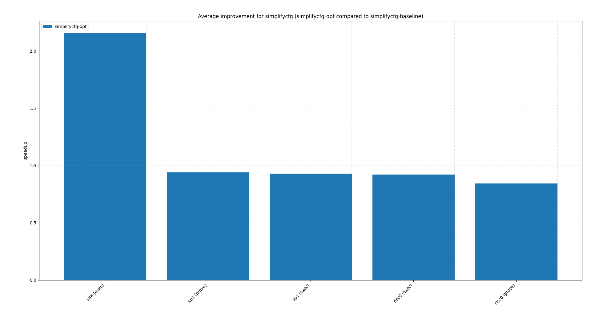
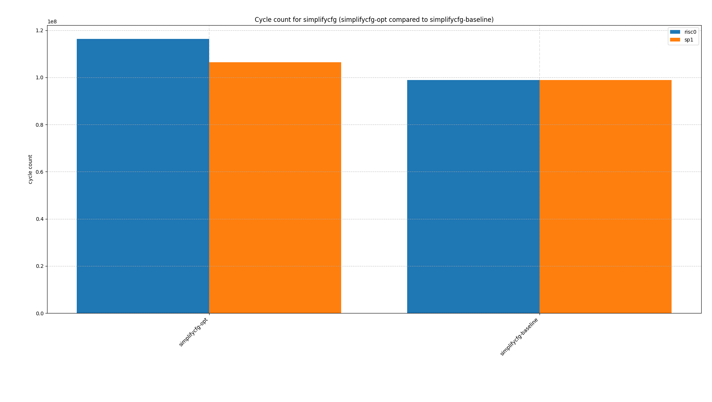

# simplifycfg

## Motivating example

```rust
#[inline(never)]
fn abs_i32_branchy(x: i32) -> i32 {
    if x < 0 {
        x.wrapping_neg()
    } else {
        x
    }
}
```

Compile with `-C no-prepopulate-passes -C passes=sroa,mem2reg,simplifycfg -C opt-level=3 -C llvm-args=-disable-cgp-branch-opts` (`simplifycfg-opt`):

```asm
srai a1, a0, 31
xor a0, a0, a1
sub a0, a0, a1
ret
```

For x86 we get the following:

```asm
mov eax, edi
neg eax
cmovs eax, edi
ret
```

Compile with `-C no-prepopulate-passes -C passes=sroa,mem2reg -C opt-level=3 -C llvm-args=-disable-cgp-branch-opts` (`simplifycfg-baseline`):

```asm
bltz a0, .LBB52_2
ret
.LBB52_2:
neg a0, a0
ret
```

For x86 we get the following:

```asm
mov eax, edi
test edi, edi
js .LBB9_1
ret
.LBB9_1:
neg eax
ret
```

The above section was tested on an array with elements chosen at random. `simplifycfg-opt` performs better on x86 as `simplifycfg-baseline` causes frequent branch predictor mispredictions. `simplifycfg-baseline` also has more variance and a Gaussian distribution, which reflects the array structure (branch predictor failure being i.i.d.). With this setup `simplifycfg-opt` is a bit more than 2x as fast as `simplifycfg-baseline` on x86.



Both zkVMs however degrade in performance if we apply `simplifycfg-opt`.







Plotting raw durations:



And the speedup we get:



The degradation can also be shown by looking at raw cycle counts:



The effect is especially visible on risc0. The effect can be mainly be explained by the fact that `simplifycfg-baseline` yields a lower cycle count, as `xor` e.g. takes two cycles.

On risc0 we get the following cycle counts by program counter for `simplifycfg-baseline`:

```asm
0x00201898: blt a0, zero, 8: 10000000 cycles
0x0020189c: jalr zero, ra, 0: 5033000 cycles
0x002018a0: sub a0, zero, a0: 4967000 cycles
0x002018a4: jalr zero, ra, 0: 4967000 cycles
```

And for `simplifycfg-opt`:

```asm
0x00201854: srai a1, a0, 1055: 10000000 cycles
0x00201858: xor a0, a0, a1: 20000000 cycles
0x0020185c: sub a0, a0, a1: 20000000 cycles
0x00201860: jalr zero, ra, 0: 10000000 cycles
```

## Conclusions

- Branches are relatively cheap on zkVMs and should therefore not always be eliminated in favor of semantically equivalent code without branches.
- When deciding which branches to eliminate and which instructions to replace them with, compilers should take into account the respective zkVM instruction costs.
- In a zkVM, executing both sides of a predicated operation is always a bad idea. Simple branching can be cheaper because only the taken path is proved.
